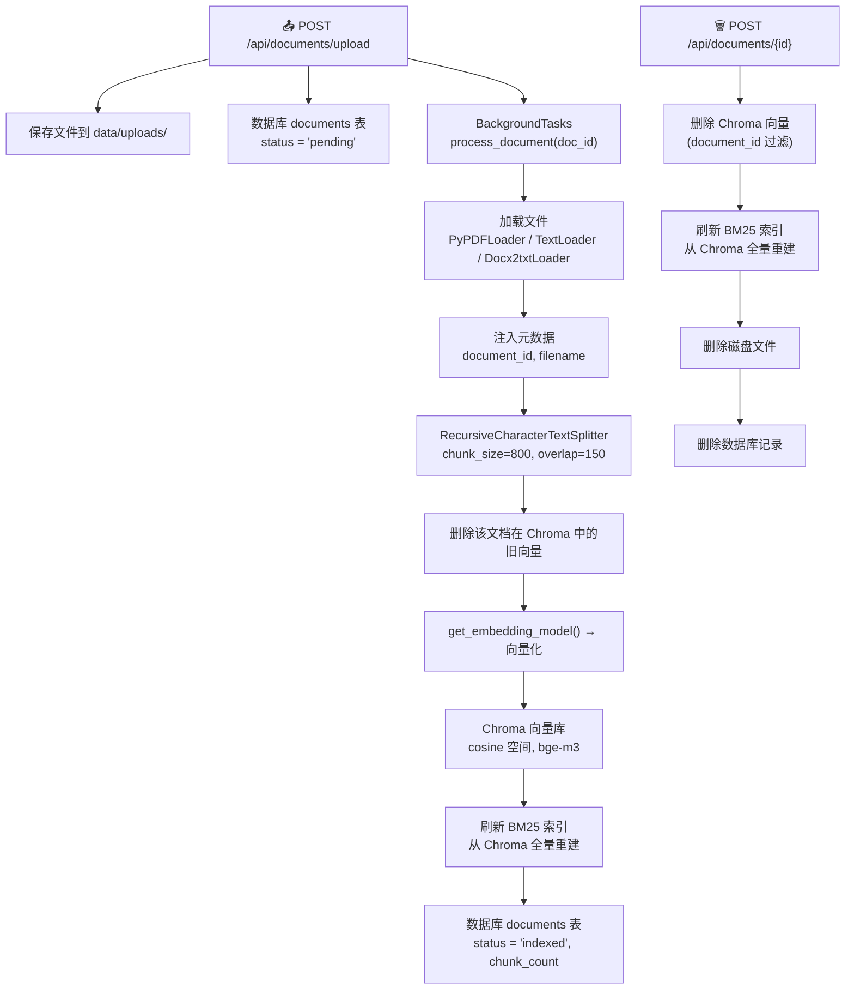
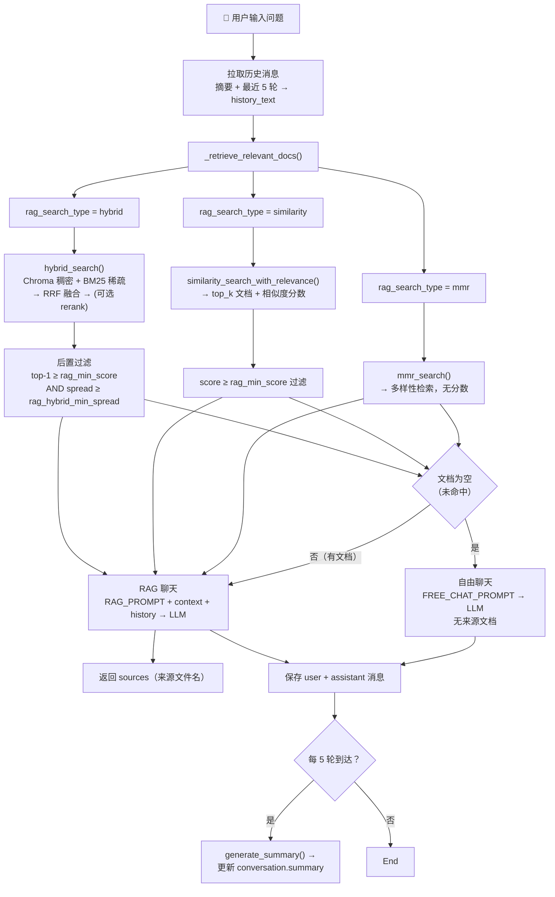
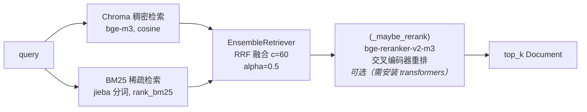
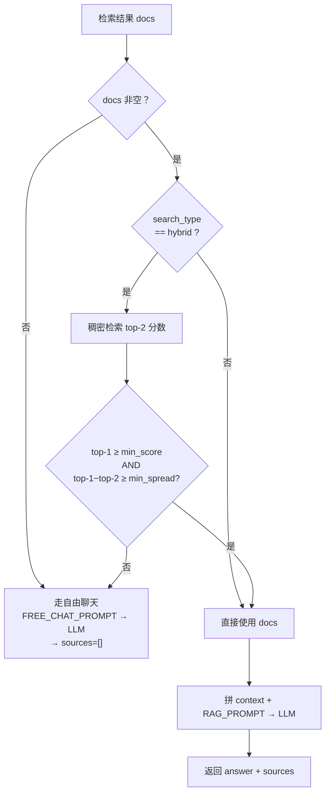
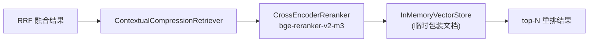

# RAG 系统完整流程

本文档完整描述本项目的 RAG（Retrieval-Augmented Generation）工作流程。

---

## 架构概述

整个系统由**两条管道**组成：

| 管道 | 方向 | 说明 |
|------|------|-------|
| **索引管道** | 文档 → 向量 + 倒排索引 | 用户上传文件，经加载、分块、嵌入后写入向量库，同时构建 BM25 稀疏索引 |
| **查询管道** | 问题 → 回答 | 用户提问，按配置的检索算法召回相关内容，经 LLM 生成带来源的回答 |

---

## 一、索引管道：文档 → 向量 + BM25 索引

### 流程图



### 第 1 步：上传

- **接口**: `POST /api/documents/upload`（`app/api/documents.py:27`）
- 接收 PDF / TXT / MD / DOCX 文件（50MB 上限）
- 保存到 `data/uploads/`，生成 UUID 文件名防重名
- 数据库 `documents` 表写入一条记录，`status = "pending"`
- 通过 FastAPI 的 `BackgroundTasks` 异步触发 `process_document()`

### 第 2 步：加载

- **函数**: `load_document()`（`app/rag/pipeline.py:19`）

根据 MIME 类型选择加载器：

| 文件类型 | MIME | 加载器 |
|----------|------|--------|
| PDF | `application/pdf` | `PyPDFLoader`（按页拆分） |
| TXT | `text/plain` | `TextLoader`（UTF-8） |
| MD | `text/markdown` | `TextLoader`（UTF-8） |
| DOCX | `application/…wordprocessingml.document` | `Docx2txtLoader` |

加载后为每页 Document 注入元数据：`document_id`、`filename`。

### 第 3 步：分块

- **函数**: `get_default_splitter()`（`app/rag/splitters.py:8`）

```python
RecursiveCharacterTextSplitter(
    chunk_size=800,       # 每块最多 800 字符
    chunk_overlap=150,    # 相邻块重叠 150 字符
    separators=["\n\n", "\n", "。", ".", " ", ""],
)
```

分块策略从粗到细：优先按段落（`\n\n`），再按句子（`。`、`.`），最后按词。

### 第 4 步：嵌入 + 索引

- **函数**: `add_documents_to_store()`（`app/rag/vector_store.py:33`）

| 组件 | 详情 |
|------|------|
| 向量数据库 | Chroma，单集合 `"documents"` |
| 空间度量 | cosine（`hnsw:space = "cosine"`） |
| 分数换算 | `relevance_score = 1 - cosine_distance`，值域 `[0, 2]` |
| 维度 | 1024（bge-m3） |
| 持久化路径 | `data/chroma/` |
| 嵌入模型 | 见下方「嵌入模型配置」 |
| 索引前清理 | `delete_documents_from_store(doc_id)` 按 `document_id` 删除旧向量 |

### 第 5 步：同步 BM25 索引

- **函数**: `refresh_bm25_index_from_chroma()`（`app/rag/retrievers.py:53`）
- 从 Chroma 全量读取所有 chunk 的 text + metadata → 调用 `BM25Retriever.from_texts()` 重建
- 使用 **jieba 分词器**（`_chinese_tokenizer`）进行中文词语级切分，替代默认单字分词
- 触发时机：
  - 文档上传处理完成（`pipeline.py:97`）
  - 文档删除后（`document_service.py:52`）

---

## 二、查询管道：问题 → 回答

### 流程图



### 第 1 步：触发

- **接口**: `POST /api/conversations/{conv_id}/query`（同步）或 `.../query/stream`（流式 SSE）
- 流式模式下：逐 token SSE 推送 `{"type": "token", "data": "…"}`，最后推送 `{"type": "sources", "data": […]}`

### 第 2 步：构建历史记忆

- **位置**: `app/api/conversations.py`（`RECENT_ROUNDS=5`, `SUMMARY_INTERVAL=10`）

记忆策略（摘要 + 滑动窗口）：

```
if 消息数量 > 10 条（超过 5 轮）:
    history = 最近 5 轮的完整消息（最近 10 条）
    summary = 之前所有轮次的 LLM 压缩摘要
else:
    history = 全部消息
    summary = None
```

**摘要自动触发**：每 5 轮（10 条消息）用 LLM 压缩整个对话历史存入 `conversations.summary`。

### 第 3 步：检索（三模式分发）

- **函数**: `_retrieve_relevant_docs()`（`app/rag/chain.py:119`）

按 `rag_search_type` 分三种模式：

#### 模式 A：hybrid（默认）— 混合检索



1. **Chroma 稠密检索**：`vs.as_retriever(k=top_k)` — bge-m3 + cosine 向量搜索
2. **BM25 稀疏检索**：`get_bm25_retriever()` — jieba 分词 + rank_bm25 关键词匹配
3. **RRF 融合**：`EnsembleRetriever` — `score(d) = Σ [weight/(c + rank_i(d))]`，其中 `c=60`
4. **可选重排**：`_maybe_rerank()` — 若 `rag_rerank_enabled=true` 且 transformers 可用，调用 bge-reranker-v2-m3 交叉编码器
5. **后置过滤**：用稠密检索再次检查 top-1 和 top-2 的相似度分数：
   - **绝对阈值**：`top-1 < rag_min_score（默认 0.4）` → 不相关
   - **离散度**：`top-1 - top-2 < rag_hybrid_min_spread（默认 0.015）` → 分数平带，无区分度
   - 两个判据任一满足 → 判定为未命中，返回空列表

#### 模式 B：similarity — 纯向量检索

1. `similarity_search_with_relevance(query, k=top_k)` → `[(Document, score)]`
2. 过滤 `score ≥ rag_min_score（默认 0.4）`

#### 模式 C：mmr — 多样性检索

1. `mmr_search(query, k=top_k)` — 平衡相关性与多样性
2. 不返回分数，不设阈值，直接取结果

### 第 4 步：自由聊天回退（Free Chat）

当 `_retrieve_relevant_docs()` 返回空列表时（所有模式均生效）：

- 切换至 `FREE_CHAT_PROMPT`（无文档上下文，纯 LLM 自身知识回答）
- 回答前加前缀：`**当前已有文档中找不到答案，以下由大模型自身知识回答：**`
- 返回 `sources: []`（无来源文档）

### 第 5 步：RAG Prompt 构造

当检索到文档时，使用 `RAG_PROMPT`：

```
System:
You are a helpful assistant for internal knowledge base queries.
Use the following context to answer the user's question.
If you don't know the answer based on the context, say so clearly.
Always cite the source document names in your answer.

Context:
[Source 1: xxx.pdf]
...匹配的文档块内容...
[Source 2: xxx.txt]
...匹配的文档块内容...

Conversation history:
[Summary of earlier conversation]
…

[Recent messages]
User: …
Assistant: …

─────────────────────────────────
Human: 用户当前的问题
```

### 第 6 步：保存与响应

- 用户消息和 LLM 回答写入 `messages` 表
- 每 5 轮触发一次 LLM 摘要更新 → `conversations.summary`
- 响应含 `answer`、`sources`（文件名列表，去重）、`chunks`（原始块内容）

---

## 三、检索模式对比

| 模式 | 配置值 | 召回方式 | 分数过滤 | 适用场景 |
|------|--------|----------|----------|----------|
| `hybrid`（默认） | `RAG_SEARCH_TYPE=hybrid` | 稠密向量 + BM25 稀疏 → RRF 融合 | top-1 阈值 + 离散度 | 通用最佳，兼顾语义和关键词 |
| `similarity` | `RAG_SEARCH_TYPE=similarity` | 纯稠密向量（cosine） | `rag_min_score` 阈值 | 只依赖语义匹配 |
| `mmr` | `RAG_SEARCH_TYPE=mmr` | 稠密向量 + MMR 多样性 | 不过滤 | 需要结果多样性时 |

---

## 四、自由聊天回退机制

### 判定流程



三种模式下均有回退能力：

| 模式 | 回退条件 | 回退路径 |
|------|----------|----------|
| `hybrid` | `top-1 < rag_min_score` **或** `spread < rag_hybrid_min_spread` | Free Chat |
| `similarity` | 所有文档 `score < rag_min_score` | Free Chat |
| `mmr` | 检索结果为空（Chroma 无数据） | Free Chat |

### 为什么要用离散度（spread）？

bge-m3 对中文 query 的向量空间高度压缩，完全不相关的 query（如"你好"）也可能打出 0.48 的 cosine 分数，与真正命中的 query 分数区间重叠。但它们的**分数分布形状**不同：

| query | top-1 | top-2 | spread | 判定 |
|-------|-------|-------|--------|------|
| "你好"（无关） | 0.4828 | 0.4743 | **0.0085** | ❌ spread < 0.015 → 平带，拦截 |
| "你们平台是什么"（相关） | 0.4928 | 0.4631 | **0.0297** | ✅ spread ≥ 0.015 → 有区分度，保留 |

因此固定绝对阈值不够，需要结合离散度来识别"无命中"。

---

## 五、Hybrid RAG 检索器架构

### BM25 稀疏检索

- **库**: `rank_bm25` + `langchain_community.retrievers.BM25Retriever`
- **中文分词**: jieba 精确模式（`jieba.lcut`），模块加载时预热
- **索引模式**: 全量内存索引，每次文档变更后从 Chroma 重建
- **索引重建触发点**:
  - `pipeline.py` 处理完文档后
  - `document_service.py` 删除文档后
  - `get_bm25_retriever()` 首次调用时（懒加载）

### 稠密向量检索

- **向量库**: Chroma（单 collection `"documents"`）
- **空间度量**: cosine（`hnsw:space = "cosine"`）
- **分数换算**: `relevance_score = 1 - cosine_distance`，值域 `[0, 2]`
- **嵌入模型**: 通过配置选择（见「嵌入模型配置」）

### RRF 融合

使用 `langchain_classic.retrievers.EnsembleRetriever`：

```
score(d) = weight_dense / (c + rank_dense(d)) + weight_sparse / (c + rank_sparse(d))
```

| 参数 | 值 | 说明 |
|------|-----|------|
| `c` | 60 | 平滑常数，防极低排名主导 |
| `alpha` | 0.5（可配） | 稠密 vs 稀疏权重，`[alpha, 1-alpha]` |

### 可选交叉编码器重排



- 仅在 `rag_rerank_enabled=true` **且** `transformers + torch` 可用时生效
- 模型：`bge-reranker-v2-m3`（可通过 `RAG_RERANK_MODEL` 配置）
- 技术：`HuggingFaceCrossEncoder` → `CrossEncoderReranker` → `ContextualCompressionRetriever`
- 资源要求：需下载模型（约 1.2GB），建议 8GB+ 内存，GPU 非必需但显著加速

---

## 六、嵌入模型配置

### 供应商选择

```python
embedding_provider: Literal["openai", "ollama", "test"] = "openai"
```

| 供应商 | 实际模型 | 配置项 | 说明 |
|--------|----------|--------|------|
| `openai` | `BAAI/bge-m3`（通过 OpenAI 兼容 API） | `EMBEDDING_API_KEY`, `EMBEDDING_API_BASE` | 兼容任何支持 bge-m3 的 OpenAI 兼容 API |
| `ollama` | `nomic-embed-text`（默认） | `OLLAMA_BASE_URL`, `OLLAMA_EMBEDDING_MODEL` | 本地 Ollama 服务 |
| `test` | 零向量 `FakeEmbeddings` | — | 测试模式，不调用外部 API |

### LLM 供应商

```python
llm_provider: Literal["openai", "ollama", "test"] = "openai"
```

| 供应商 | 默认模型 | 说明 |
|--------|----------|------|
| `openai` | `gpt-4o-mini` | temperature=0.3 |
| `ollama` | `qwen2.5:7b` | 本地 LLM，temperature=0.3 |
| `test` | 固定 mock 回答 | 测试用 |

---

## 七、核心配置一览

| 配置项 | 默认值 | 说明 |
|--------|--------|------|
| `RAG_SEARCH_TYPE` | `hybrid` | 检索模式：`similarity` / `mmr` / `hybrid` |
| `RAG_HYBRID_ALPHA` | `0.5` | 稠密 vs 稀疏权重（0=纯BM25, 1=纯向量） |
| `RAG_HYBRID_MIN_SPREAD` | `0.015` | hybrid 模式下 top-1 与 top-2 的最小分数差，低于此值判为未命中 |
| `RAG_MIN_SCORE` | `0.4` | 相关性绝对阈值（similarity 模式 + hybrid 后置过滤共用） |
| `RAG_RERANK_ENABLED` | `false` | 是否启用 bge-reranker 交叉编码器重排 |
| `RAG_RERANK_MODEL` | `BAAI/bge-reranker-v2-m3` | 重排器模型名或本地路径 |
| `RAG_RERANK_TOP_N` | `5` | 重排后保留的 top-n 结果 |
| `CHUNK_SIZE` | `800` | 文本分块大小（字符） |
| `CHUNK_OVERLAP` | `150` | 分块重叠大小（字符） |
| `CHROMA_COLLECTION_NAME` | `documents` | Chroma 集合名 |
| `CHROMA_PERSIST_DIR` | `./data/chroma` | Chroma 持久化路径 |
| `LLM_TEMPERATURE` | `0.3` | LLM 生成温度（代码中设置） |
| `RECENT_ROUNDS` | `5` | 对话滑动窗口保留轮次 |
| `SUMMARY_INTERVAL` | `10` 条消息 | 摘要触发间隔（每 5 轮） |

---

## 八、相关源码文件速查

### 模块文件

| 文件 | 职责 |
|------|------|
| `app/api/documents.py` | 文档上传、列表、删除、重新处理接口 |
| `app/api/conversations.py` | 对话 CRUD、历史记忆组装、RAG 查询入口 |
| `app/rag/pipeline.py` | 文档处理流程编排（加载→分块→索引→BM25同步） |
| `app/rag/chain.py` | RAG 查询链、自由聊天、对话摘要生成 |
| `app/rag/retrievers.py` | BM25 索引管理、hybrid 混合检索、可选 reranker |
| `app/rag/vector_store.py` | Chroma 封装（单集合 "documents"） |
| `app/rag/embeddings.py` | 嵌入模型初始化（OpenAI/Ollama/Test） |
| `app/rag/llms.py` | LLM 初始化（OpenAI/Ollama/Test） |
| `app/rag/splitters.py` | 文本分块配置 |
| `app/config.py` | 全局配置（pydantic-settings + `.env`） |

### 检索器依赖链

```
hybrid_search() ──▶ EnsembleRetriever
    ├─ dense_retriever ──▶ Chroma ──▶ bge-m3
    └─ sparse_retriever ──▶ BM25Retriever ──▶ jieba + rank_bm25
                              ↑
refresh_bm25_index_from_chroma()
    └─ 从 Chroma.get() 全量读取 text + metadata
```

### 服务层文件

| 文件 | 职责 |
|------|------|
| `app/services/document_service.py` | 文档 CRUD、状态管理（含 BM25 同步触发） |
| `app/services/conversation_service.py` | 对话/消息数据库操作 |
| `app/models/document.py` | Document ORM 模型 |
| `app/models/conversation.py` | Conversation / Message ORM 模型 |

---

## 九、常见问题排查

### Q：不相关的 query 也返回了来源文档？

检查 `rag_min_score` 和 `rag_hybrid_min_spread` 阈值。bge-m3 的 cosine 分数分布紧凑（0.44~0.50），纯靠绝对阈值拦不住，需要结合 spread 过滤。

诊断方法（在 `chain.py` 日志中查看）：

```python
# hybrid 模式下会在日志输出：
"Hybrid top-1=0.483 spread=0.009 (min_score=0.400, min_spread=0.015) → 判定未命中，回退自由聊天"
```

### Q：BM25 检索效果不理想？

- 确认已安装 `jieba`（`uv add jieba`）——项目已集成 jieba 分词器作为 BM25 的 `preprocess_func`
- 确认 BM25 索引已从 Chroma 重建：每次上传/删除文档后，`refresh_bm25_index_from_chroma()` 会自动调用
- BM25 是全量内存索引，文档量大时重建耗时可能增加，当前为全量重建（非增量）

### Q：如何启用 reranker？

```bash
# 1. 安装依赖
uv sync --extra transformers
# 如果 transformers/torch 已在主依赖中（pyproject.toml 已纳入），只需 uv sync

# 2. .env 中配置
RAG_RERANK_ENABLED=true
RAG_RERANK_MODEL=BAAI/bge-reranker-v2-m3  # 或本地路径 /path/to/model

# 3. 重启后端
```

### Q：MMR 模式下也出现了不相关文档的来源？

MMR 模式不设阈值过滤。如果经常遇到无关结果，建议切换到 `similarity` 模式并适当调高 `rag_min_score`（如 0.5），或使用默认的 `hybrid` 模式（有 spread 过滤更准确）。