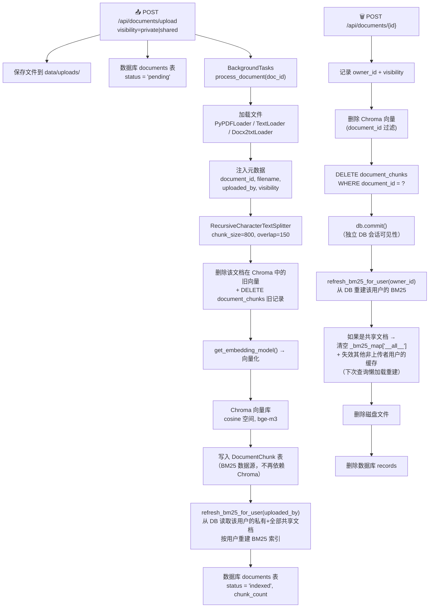
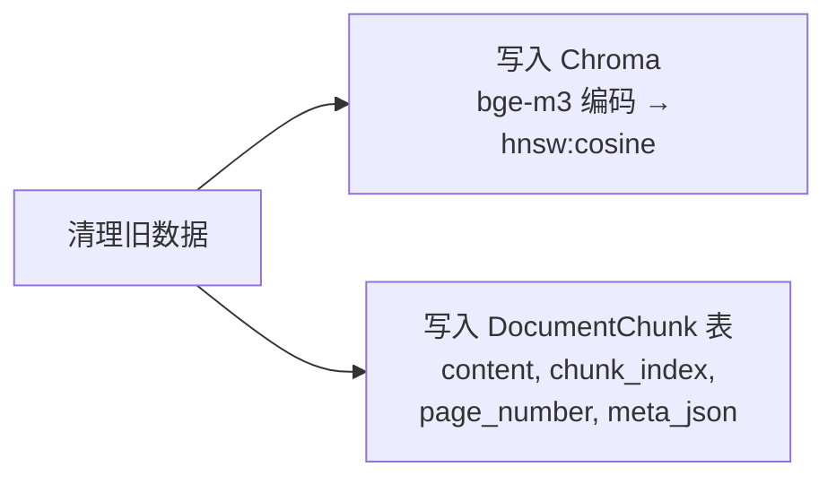
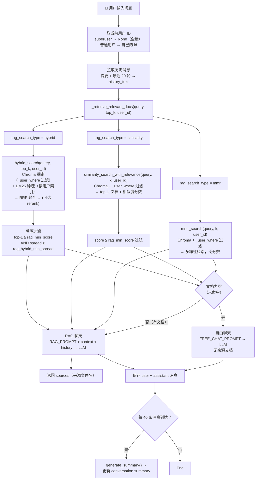
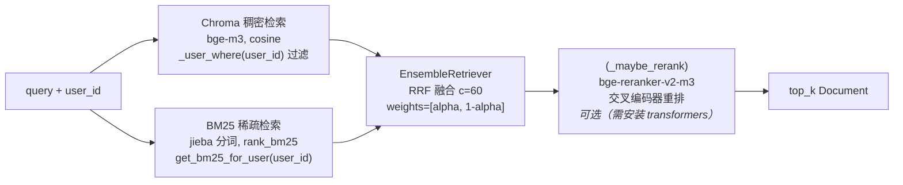
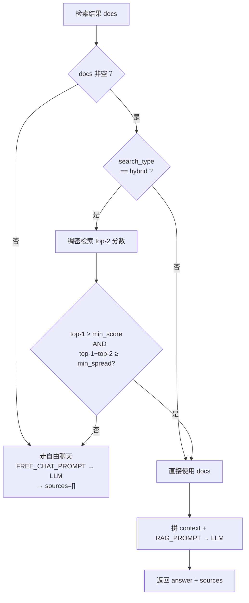
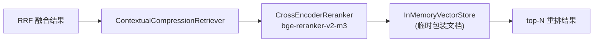

# RAG 系统完整流程

本文档完整描述本项目的 RAG（Retrieval-Augmented Generation）工作流程。

---

## 架构概述

整个系统由**两条管道**组成：

| 管道 | 方向 | 说明 |
|------|------|-------|
| **索引管道** | 文档 → 向量 + DocumentChunk 持久化 + BM25 索引 | 用户上传文件，经加载、分块、嵌入后写入向量库，同时将 chunks 持久化到 SQLite，最后按用户增量重建 BM25 稀疏索引 |
| **查询管道** | 问题 → 回答 | 用户提问，传入当前用户 ID，按配置的检索算法（带用户级过滤）召回相关内容，经 LLM 生成带来源的回答 |

---

## 一、索引管道：文档 → 向量 + DocumentChunk + BM25 索引

### 流程图



### 第 1 步：上传

- **接口**: `POST /api/documents/upload`（`app/api/documents.py:27`）
- 接收 PDF / TXT / MD / DOCX 文件（50MB 上限）
- 支持 `visibility=private`（默认，仅上传者可见）或 `visibility=shared`（所有人可见）
- 保存到 `data/uploads/`，生成 UUID 文件名防重名
- 数据库 `documents` 表写入一条记录，`status = "pending"`
- 通过 FastAPI 的 `BackgroundTasks` 异步触发 `process_document()`

### 第 2 步：加载

- **函数**: `load_document()`（`app/rag/pipeline.py:22`）

根据 MIME 类型选择加载器：

| 文件类型 | MIME | 加载器 |
|----------|------|--------|
| PDF | `application/pdf` | `PyPDFLoader`（按页拆分） |
| TXT | `text/plain` | `TextLoader`（UTF-8） |
| MD | `text/markdown` | `TextLoader`（UTF-8） |
| DOCX | `application/…wordprocessingml.document` | `Docx2txtLoader` |

### 第 3 步：注入元数据

```python
# pipeline.py:73-78
d.metadata["document_id"]  = doc.id              # 按文档删除
d.metadata["filename"]     = doc.original_filename # 溯源引用
d.metadata["uploaded_by"]  = str(doc.uploaded_by)  # 多租户隔离
d.metadata["visibility"]   = doc.visibility         # 共享/私有
```

这些元数据会随 chunk 一起写入 Chroma，用于后续搜索时的 `_user_where()` 过滤。

### 第 4 步：分块

- **函数**: `get_default_splitter()`（`app/rag/splitters.py:8`）

```python
RecursiveCharacterTextSplitter(
    chunk_size=800,       # 每块最多 800 字符
    chunk_overlap=150,    # 相邻块重叠 150 字符
    separators=["\n\n", "\n", "。", ".", " ", ""],
)
```

分块策略从粗到细：优先按段落（`\n\n`），再按句子（`。`、`.`），最后按词。

### 第 5 步：清理旧数据 + 索引

在写入新数据前先清理该文档的旧数据（防止重复处理时累积孤儿条目）：

1. **清理 Chroma 旧向量**：`delete_documents_from_store(doc_id)` 按 `document_id` 元数据过滤删除
2. **清理 DB 旧 chunks**：`DELETE FROM document_chunks WHERE document_id = ...`

两个清理完成后写入新数据：



#### 向量库写入

- **函数**: `add_documents_to_store()`（`app/rag/vector_store.py:59`）

| 组件 | 详情 |
|------|------|
| 向量数据库 | Chroma，单集合 `"documents"` |
| 空间度量 | cosine（`hnsw:space = "cosine"`） |
| 分数换算 | `relevance_score = 1 - cosine_distance`，值域 `[0, 2]` |
| 维度 | 1024（bge-m3） |
| 持久化路径 | `data/chroma/` |
| 嵌入模型 | 见下方「嵌入模型配置」 |

#### DocumentChunk 表写入

- **位置**: `app/rag/pipeline.py:97-108`

```python
for i, chunk in enumerate(chunks):
    dc = DocumentChunk(
        id=str(uuid.uuid4()),
        document_id=str(doc.id),
        chunk_index=i,
        content=chunk.page_content,
        page_number=chunk.metadata.get("page"),
        meta_json=json.dumps(chunk.metadata, ensure_ascii=False),
    )
    db.add(dc)
db.commit()
```

> **为什么多这一步？** DocumentChunk 表是 BM25 索引的**独立数据源**。以前 BM25 重建依赖 `Chroma.get()` 全量读取，耦合了向量存储和稀疏索引。现在 BM25 直接从 SQLite 读 chunks，解耦了两者，且增量管理更简单。

### 第 6 步：同步 BM25 索引（按用户）

- **函数**: `refresh_bm25_for_user(user_id)`（`app/rag/retrievers.py:43`）
- **触发时机**：文档处理完成后立即执行

```python
# 不再是旧的 refresh_bm25_index_from_chroma()（已废弃）
# 改为按用户 ID 增量重建：
refresh_bm25_for_user(str(doc.uploaded_by))
```

**重建逻辑**：

```python
def refresh_bm25_for_user(user_id: str) -> None:
    # 1. 从 DocumentChunk 表读取该用户的私有 + 全部共享文档的 chunks
    chunks = (
        db.query(DocumentChunk)
        .join(Document)
        .filter(
            (Document.uploaded_by == user_id)       # 自己上传的
            | (Document.visibility == "shared"),     # 所有人的共享文档
        )
        .all()
    )
    # 2. 全量重建该用户的 BM25 索引
    BM25Retriever.from_texts(texts, metadatas=metadatas,
                             preprocess_func=_chinese_tokenizer)
    # 3. 存入 _bm25_map[user_id]（线程安全）
```

**重建依赖**：

```
refresh_bm25_for_user(user_id)
    └─▶ DocumentChunk 表（data/app.db）
          ├─ content  → BM25 语料
          └─ meta_json → 元数据（document_id, filename, uploaded_by, visibility）
    └─▶ jieba 中文分词（词语级，非单字）
    └─▶ BM25Retriever.from_texts()
    └─▶ _bm25_map[user_id] ← 内存
```

---

## 二、查询管道：问题 → 回答

### 流程图



### 第 1 步：触发 + 用户身份注入

- **接口**: `POST /api/conversations/{conv_id}/query`（同步）或 `.../query/stream`（流式 SSE）
- 流式模式下：逐 token SSE 推送 `{"type": "token", "data": "…"}`，最后推送 `{"type": "sources", "data": […]}`

**用户 ID 构造**（`app/api/conversations.py:173-174`）：

```python
# superuser → None（全量检索，不设 Chroma 过滤）
# 普通用户 → 自己的 user_id（Chroma 按 uploaded_by/visibility 过滤）
uid = None if current_user.is_superuser else str(current_user.id)
```

### 第 2 步：构建历史记忆

- **位置**: `app/api/conversations.py`（`RECENT_ROUNDS=20`, `SUMMARY_INTERVAL=40`）

记忆策略（摘要 + 滑动窗口）：

```
if 消息数量 > 40 条（超过 20 轮）:
    history = 最近 20 轮的完整消息（最近 40 条）
    summary = 之前所有轮次的 LLM 压缩摘要
else:
    history = 全部消息
    summary = None
```

**摘要自动触发**：每 20 轮（40 条消息）用 LLM 压缩整个对话历史存入 `conversations.summary`。

### 第 3 步：检索（三模式分发，均支持用户过滤）

- **函数**: `_retrieve_relevant_docs()`（`app/rag/chain.py:125`）

按 `rag_search_type` 分三种模式。所有模式都接收 `user_id` 参数并传递给 Chroma 的 `_user_where()` 过滤。

#### 模式 A：hybrid（默认）— 混合检索



1. **Chroma 稠密检索**：`vs.as_retriever(k=top_k, filter=_user_where(user_id))` — bge-m3 + cosine 向量搜索
2. **BM25 稀疏检索**：`get_bm25_for_user(user_id)` — 从 `_bm25_map` 取该用户的索引（含私有文档 + 全部共享文档），jieba 分词 + rank_bm25 关键词匹配
3. **RRF 融合**：`EnsembleRetriever` — `score(d) = Σ [weight/(c + rank_i(d))]`，其中 `c=60`
4. **可选重排**：`_maybe_rerank()` — 若 `rag_rerank_enabled=true` 且 transformers 可用，调用 bge-reranker-v2-m3 交叉编码器
5. **后置过滤**：用稠密检索再取 top-2，检查：
   - **绝对阈值**：`top-1 < rag_min_score（默认 0.4）` → 不相关
   - **离散度**：`top-1 - top-2 < rag_hybrid_min_spread（默认 0.015）` → 分数平带，无区分度
   - 任一判据满足 → 判为未命中，返回空列表

#### 模式 B：similarity — 纯向量检索

1. `similarity_search_with_relevance(query, k=top_k, user_id=user_id)` → `[(Document, score)]`
2. 过滤 `score ≥ rag_min_score（默认 0.4）`

#### 模式 C：mmr — 多样性检索

1. `mmr_search(query, k=top_k, user_id=user_id)` — 平衡相关性与多样性
2. 不返回分数，不设阈值，直接取结果

### Chroma 用户过滤函数

```python
# vector_store.py:17-31
def _user_where(user_id: str | None) -> dict | None:
    if user_id is None:        # superuser → 不过滤，全量可见
        return None
    return {"$or": [           # 普通用户 → 自己的私有 + 全部共享
        {"uploaded_by": {"$eq": user_id}},
        {"visibility": {"$eq": "shared"}},
    ]}
```

Chroma 原生支持 `$or` 和 `$eq` 操作符的 metadata 过滤，所有搜索函数均传入此条件。

### 第 4 步：自由聊天回退（Free Chat）

当 `_retrieve_relevant_docs()` 返回空列表时（所有模式均生效）：

- 切换至 `FREE_CHAT_PROMPT`（无文档上下文，纯 LLM 自身知识回答）
- 前端按 `free_chat=true` 标记渲染提示语，不进入模型输出路径
- 返回 `sources: []`（无来源文档），入库的历史消息不含提示语

### 第 5 步：RAG Prompt 构造

当检索到文档时，使用 `RAG_PROMPT`：

```
System:
You are a helpful assistant for internal knowledge base queries.
Use the following context to answer the user's question.
If you don't know the answer based on the context, say so clearly.
Always cite the source document names in your answer.

Context:
[Source 1: xxx.pdf]
...匹配的文档块内容...
[Source 2: xxx.txt]
...匹配的文档块内容...

Conversation history:
[Summary of earlier conversation]
…

[Recent messages]
User: …
Assistant: …

─────────────────────────────────
Human: 用户当前的问题
```

### 第 6 步：保存与响应

- 用户消息和 LLM 回答写入 `messages` 表
- 流式模式下：用户消息**同步**保存（保证下一轮 `_build_history` 必能读到），助手回答在流结束后通过 `BackgroundTasks`**异步**入库
- 每 20 轮（40 条消息）触发一次 LLM 摘要更新 → `conversations.summary`
- 响应含 `answer`、`sources`（文件名列表，去重）、`free_chat`（布尔标记）

---

## 三、检索模式对比

| 模式 | 配置值 | 召回方式 | Chroma 过滤 | BM25 | 用户隔离 | 适用场景 |
|------|--------|----------|-------------|------|----------|----------|
| `hybrid`（默认） | `RAG_SEARCH_TYPE=hybrid` | 稠密向量 + BM25 稀疏 → RRF 融合 | ✅ `_user_where()` | ✅ 按用户 | ✅ | 通用最佳，兼顾语义和关键词 |
| `similarity` | `RAG_SEARCH_TYPE=similarity` | 纯稠密向量（cosine） | ✅ `_user_where()` | ❌ | ✅ | 只依赖语义匹配 |
| `mmr` | `RAG_SEARCH_TYPE=mmr` | 稠密向量 + MMR 多样性 | ✅ `_user_where()` | ❌ | ✅ | 需要结果多样性时 |

---

## 四、自由聊天回退机制

### 判定流程



三种模式下均有回退能力：

| 模式 | 回退条件 | 回退路径 |
|------|----------|----------|
| `hybrid` | `top-1 < rag_min_score` **或** `spread < rag_hybrid_min_spread` | Free Chat |
| `similarity` | 所有文档 `score < rag_min_score` | Free Chat |
| `mmr` | 检索结果为空（Chroma 无数据） | Free Chat |

### 为什么要用离散度（spread）？

bge-m3 对中文 query 的向量空间高度压缩，完全不相关的 query（如"你好"）也可能打出 0.48 的 cosine 分数，与真正命中的 query 分数区间重叠。但它们的**分数分布形状**不同：

| query | top-1 | top-2 | spread | 判定 |
|-------|-------|-------|--------|------|
| "你好"（无关） | 0.4828 | 0.4743 | **0.0085** | ❌ spread < 0.015 → 平带，拦截 |
| "你们平台是什么"（相关） | 0.4928 | 0.4631 | **0.0297** | ✅ spread ≥ 0.015 → 有区分度，保留 |

因此固定绝对阈值不够，需要结合离散度来识别"无命中"。

---

## 五、Hybrid RAG 检索器架构

### BM25 稀疏检索（按用户隔离）

#### 索引存储

BM25 索引全部在**内存**中，存储在模块级字典（`app/rag/retrievers.py:29`）：

```python
_bm25_map: dict[str, BM25Retriever | None] = {}  # user_id → BM25 索引
_bm25_lock = threading.Lock()                     # 线程安全
```

| 键（key） | 索引内容 | 使用场景 |
|-----------|----------|----------|
| `user_id`（普通用户 UUID） | 该用户的私有文档 + 全部共享文档 | 普通用户查询 |
| `"__all__"`（superuser） | 全部文档（无任何过滤） | admin 查询全量 |

#### 数据源

BM25 索引从 `DocumentChunk` 表重建，**不再**从 Chroma 读取：

```
DocumentChunk 表（data/app.db）
  └─ content     → BM25 语料
  └─ meta_json   → 元数据（用户过滤用）
      └─ jieba 分词 → BM25Retriever.from_texts() → _bm25_map[key]
```

#### 重建时机

| 事件 | 触发函数 | 重建目标 | 方式 |
|------|---------|----------|------|
| **文档上传处理完毕** | `pipeline.py:119` | `refresh_bm25_for_user(uploaded_by)` | 从 DB 全量重建该用户 |
| **文档删除后** | `document_service.py:68` | `refresh_bm25_for_user(owner_id)` | 从 DB 全量重建该用户 |
| **首次查询某用户** | `get_bm25_for_user(user_id)` 发现 key 缺失 | 懒加载重建 | 从 DB 全量重建 |
| **共享文档删除后** | `document_service.py:74-75` | 清空 `_bm25_map["__all__"]` | 删除缓存，下次 superuser 查询时懒加载 |

#### 核心函数

```python
# 主动重建（上传/删除后调用）
refresh_bm25_for_user(user_id)    # 重建单个用户的 BM25（私有+共享）
refresh_bm25_all()                 # 重建全量 BM25（superuser 用）

# 懒加载（查询时调用）
get_bm25_for_user(user_id | None) # 不存在时自动重建，None=superuser
```

#### 分词器

```python
def _chinese_tokenizer(text: str) -> list[str]:
    """jieba 精确模式，词语级切分。"""
    return [t for t in jieba.lcut(text) if t.strip()]
```

BM25Retriever 默认 tokenizer 只做 lowercase + 按非字母数字字符 split，对中文会退化成单字（unigram）匹配。使用 jieba 后整个词语作为一个 term 参与 BM25 的 IDF/词频计算，显著提升中文相关性。

### 稠密向量检索

- **向量库**: Chroma（单 collection `"documents"`）
- **空间度量**: cosine（`hnsw:space = "cosine"`）
- **分数换算**: `relevance_score = 1 - cosine_distance`，值域 `[0, 2]`
- **嵌入模型**: 通过配置选择（见「嵌入模型配置」）
- **用户过滤**: `_user_where(user_id)` → `$or` 条件

### RRF 融合

使用 `langchain_classic.retrievers.EnsembleRetriever`：

```
score(d) = weight_dense / (c + rank_dense(d)) + weight_sparse / (c + rank_sparse(d))
```

| 参数 | 值 | 说明 |
|------|-----|------|
| `c` | 60 | 平滑常数，防极低排名主导 |
| `alpha` | 0.5（可配） | 稠密 vs 稀疏权重，`[alpha, 1-alpha]` |

### 可选交叉编码器重排



- 仅在 `rag_rerank_enabled=true` **且** `transformers + torch` 可用时生效
- 模型：`bge-reranker-v2-m3`（可通过 `RAG_RERANK_MODEL` 配置）
- 技术：`HuggingFaceCrossEncoder` → `CrossEncoderReranker` → `ContextualCompressionRetriever`
- 资源要求：需下载模型（约 1.2GB），建议 8GB+ 内存，GPU 非必需但显著加速

---

## 六、多租户数据隔离模型

### 核心设计

| 用户类型 | BM25 索引 | Chroma 过滤 | 可见文档范围 |
|----------|-----------|-------------|-------------|
| **普通用户** | `_bm25_map[user_id]`（私有的+共享的） | `$or: [uploaded_by=自己, visibility=shared]` | 自己上传的 + 所有人共享的 |
| **Superuser (admin)** | `_bm25_map["__all__"]`（全部文档） | `None`（不过滤） | 全部文档 |

### 共享文档变更时的缓存策略

删除或修改一份共享文档时：

1. 触发 `refresh_bm25_for_user(owner_id)` → 文档所有者的 BM25 立即更新
2. 触发 `invalidate_other_users_bm25(except_user_id=owner_id)` → 清空其他所有用户的 BM25 缓存（包括 superuser 的 `__all__` 全量索引），下次查询时懒加载重建
3. 其他普通用户和 superuser 的下一查询自动触发 `get_bm25_for_user()` 从 DocumentChunk 表重建 BM25

---

## 七、嵌入模型配置

### 供应商选择

```python
embedding_provider: Literal["openai", "ollama", "test"] = "openai"
```

| 供应商 | 实际模型 | 配置项 | 说明 |
|--------|----------|--------|------|
| `openai` | `BAAI/bge-m3`（通过 OpenAI 兼容 API） | `EMBEDDING_API_KEY`, `EMBEDDING_API_BASE` | 兼容任何支持 bge-m3 的 OpenAI 兼容 API |
| `ollama` | `nomic-embed-text`（默认） | `OLLAMA_BASE_URL`, `OLLAMA_EMBEDDING_MODEL` | 本地 Ollama 服务 |
| `test` | 零向量 `FakeEmbeddings` | — | 测试模式，不调用外部 API |

### LLM 供应商

```python
llm_provider: Literal["openai", "ollama", "test"] = "openai"
```

| 供应商 | 默认模型 | 说明 |
|--------|----------|------|
| `openai` | `gpt-4o-mini` | temperature=0.3 |
| `ollama` | `qwen2.5:7b` | 本地 LLM，temperature=0.3 |
| `test` | 固定 mock 回答 | 测试用 |

---

## 八、核心配置一览

| 配置项 | 默认值 | 说明 |
|--------|--------|------|
| `RAG_SEARCH_TYPE` | `hybrid` | 检索模式：`similarity` / `mmr` / `hybrid` |
| `RAG_HYBRID_ALPHA` | `0.5` | 稠密 vs 稀疏权重（0=纯BM25, 1=纯向量） |
| `RAG_HYBRID_MIN_SPREAD` | `0.015` | hybrid 模式下 top-1 与 top-2 的最小分数差，低于此值判为未命中 |
| `RAG_MIN_SCORE` | `0.4` | 相关性绝对阈值（similarity 模式 + hybrid 后置过滤共用） |
| `RAG_RERANK_ENABLED` | `false` | 是否启用 bge-reranker 交叉编码器重排 |
| `RAG_RERANK_MODEL` | `BAAI/bge-reranker-v2-m3` | 重排器模型名或本地路径 |
| `RAG_RERANK_TOP_N` | `5` | 重排后保留的 top-n 结果 |
| `CHUNK_SIZE` | `800` | 文本分块大小（字符） |
| `CHUNK_OVERLAP` | `150` | 分块重叠大小（字符） |
| `CHROMA_COLLECTION_NAME` | `documents` | Chroma 集合名 |
| `CHROMA_PERSIST_DIR` | `./data/chroma` | Chroma 持久化路径 |
| `RECENT_ROUNDS` | `20` | 对话滑动窗口保留轮次（代码中常量） |
| `SUMMARY_INTERVAL` | `40` 条消息 | 摘要触发间隔（每 20 轮） |

---

## 九、相关源码文件速查

### 模块文件

| 文件 | 职责 |
|------|------|
| `app/api/documents.py` | 文档上传、列表、删除、重新处理接口（支持 visibility 参数） |
| `app/api/conversations.py` | 对话 CRUD、历史记忆组装、RAG 查询入口（注入 user_id） |
| `app/rag/pipeline.py` | 文档处理流程编排（加载→分块→metadata→Chroma→DocumentChunk→BM25重建） |
| `app/rag/chain.py` | RAG 查询链、自由聊天、对话摘要生成（传递 user_id 至检索层） |
| `app/rag/retrievers.py` | 按用户 BM25 索引管理、hybrid 混合检索、可选 reranker |
| `app/rag/vector_store.py` | Chroma 封装 + `_user_where()` 多租户过滤 |
| `app/rag/embeddings.py` | 嵌入模型初始化（OpenAI/Ollama/Test） |
| `app/rag/llms.py` | LLM 初始化（OpenAI/Ollama/Test） |
| `app/rag/splitters.py` | 文本分块配置 |
| `app/config.py` | 全局配置（pydantic-settings + `.env`） |

### 检索器依赖链

```
hybrid_search(query, top_k, user_id) ──▶ EnsembleRetriever
    ├─ dense_retriever ──▶ Chroma ──▶ bge-m3
    │                         filter: _user_where(user_id)
    │                           ├─ superuser → None（全量）
    │                           └─ 普通用户 → $or: [uploaded_by, visibility=shared]
    │
    └─ sparse_retriever ──▶ get_bm25_for_user(user_id)
                              ├─ _bm25_map["__all__"]（superuser）
                              └─ _bm25_map[user_id]（普通用户）
                                    ↑
                              refresh_bm25_for_user(user_id)
                                  └─ DocumentChunk 表（data/app.db）
                                      └─ content + meta_json
```

### 服务层文件

| 文件 | 职责 |
|------|------|
| `app/services/document_service.py` | 文档 CRUD、状态管理（含 BM25 按用户同步触发 + 共享文档缓存清理） |
| `app/services/conversation_service.py` | 对话/消息数据库操作 |
| `app/models/document.py` | Document + DocumentChunk ORM 模型 |
| `app/models/conversation.py` | Conversation / Message ORM 模型 |
| `app/models/user.py` | User ORM 模型 |

---

## 十、常见问题排查

### Q：不相关的 query 也返回了来源文档？

检查 `rag_min_score` 和 `rag_hybrid_min_spread` 阈值。bge-m3 的 cosine 分数分布紧凑（0.44~0.50），纯靠绝对阈值拦不住，需要结合 spread 过滤。

诊断方法（在 `chain.py` 日志中查看）：

```python
# hybrid 模式下会在日志输出：
"Hybrid top-1=0.483 spread=0.009 (min_score=0.400, min_spread=0.015) → 判定未命中，回退自由聊天"
```

### Q：BM25 检索效果不理想？

- 确认已安装 `jieba`（`uv add jieba`）——项目已集成 jieba 分词器作为 BM25 的 `preprocess_func`
- 确认 BM25 索引已从 DocumentChunk 表重建：每次上传/删除文档后，`refresh_bm25_for_user(user_id)` 会自动调用
- BM25 是全量内存索引，当前为**按用户全量重建**（从 DB 读私有+共享 chunks，非增量更新）

### Q：如何启用 reranker？

```bash
# 1. 安装依赖
uv sync --extra transformers
# 如果 transformers/torch 已在主依赖中（pyproject.toml 已纳入），只需 uv sync

# 2. .env 中配置
RAG_RERANK_ENABLED=true
RAG_RERANK_MODEL=BAAI/bge-reranker-v2-m3  # 或本地路径 /path/to/model

# 3. 重启后端
```

### Q：用户 A 看到了用户 B 的文档？

检查以下环节：

1. **确认文档的 visibility**：用户 B 的文档是否设为了 `shared`？只有共享文档才对其他用户可见
2. **确认 `_user_where` 过滤生效**：搜索时是否传入了 `user_id`？superuser（admin）默认不过滤，全量可见
3. **检查 Chroma metadata**：旧文档可能缺少 `uploaded_by` 和 `visibility` 字段，需运行迁移脚本：
   ```bash
   .venv/bin/python scripts/migrate_chroma_tenant.py
   ```
   或清空 Chroma 后重新上传所有文档：
   ```bash
   rm -rf data/chroma
   ```

### Q：MMR 模式下也出现了不相关文档的来源？

MMR 模式不设阈值过滤。如果经常遇到无关结果，建议切换到 `similarity` 模式并适当调高 `rag_min_score`（如 0.5），或使用默认的 `hybrid` 模式（有 spread 过滤更准确）。