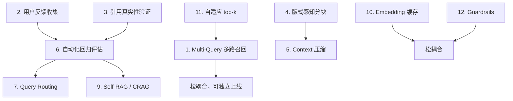

# RAG 模块优化清单

> 依据 `app/rag/` 模块与业界生产级 RAG 标准（2025-2026）逐项对比整理。
>
> 各任务按 **投入产出比** 降序排列。

---

## ✅ 已具备的能力

| 能力 | 位置 |
|------|------|
| PGVector 稠密检索 | `vector_store.py` |
| PG tsvector 稀疏检索（增量、零内存） | `sparse_search.py` |
| RRF 融合 + 凸组合权重 | `retrievers.py` |
| 多轮对话查询改写 | `chain.py` |
| 相关性阈值 + spread 判定 → free chat 回退 | `chain.py` |
| 可选交叉编码器重排 | `rerankers.py` |
| 来源标注 + 去重 + 越界引用剔除 | `chain.py` |
| 对话摘要 | `chain.py` |
| Celery 幂等重试 + 文档状态机 | `pipeline.py` |
| 多 worker BM25 一致性（Redis 版本号） | `retrievers.py` |
| Markdown 按标题层级切分 | `splitters.py` |
| Ragas 评估脚本 | `scripts/eval_ragas.py` |
| LangSmith 观测（刚接入） | `main.py` + `.env` |

---

## P0 — 高收益，实现简单

### ✅ 1. Multi-Query 多路召回（已完成）

- **问题**：一个问题的不同侧面可能由不同 chunk 覆盖。例如"不签合同的处罚和解除合同的流程"需要两类 chunk。当前 top_k=5 固定检索，可能只命中其中一个侧面。
- **方案**：在 `_retrieve_relevant_docs` 检索前，让 LLM 将用户问题从 3 个不同角度改写，分别检索，去重合并后进 RRF 融合。
- **改动文件**：`app/rag/retrievers.py` + `app/config.py` + `app/rag/chain.py`
- **预期收益**：召回率提升 15-20%，对复合问题尤其明显。
- **完成状态**：✅ 已编码并通过静态编译验证（去重、首路加权、变体权重均校验通过）。改动见下方"实施方案"小节。

> **澄清：Multi-Query 不同于已有的混合（稀疏+稠密）检索。**
>
> 这两者解决的是**不同维度**的问题，是正交关系，而非重复：
>
> | | 解决的问题 | 变化的维度 |
> |--|-----------|-----------|
> | **混合检索**（已有） | 同一句话，两种算法互补 | **检索算法**（稠密 vs 稀疏） |
> | **Multi-Query**（本任务） | 换个说法，覆盖问题不同侧面 | **查询词本身** |
>
> ```mermaid
> flowchart TB
>     subgraph 混合检索-现状-多算法一路
>         A1[一个问题] --> B1[稠密检索 PGVector]
>         A1 --> C1[稀疏检索 PG tsvector]
>         B1 --> D1[RRF 融合]
>         C1 --> D1
>     end
>     subgraph Multi-Query-待加-多查询词多路
>         A2[一个问题] --> B2[视角A 原问题]
>         A2 --> C2[视角B 改写]
>         A2 --> E2[视角C 改写]
>         B2 --> F2[各自走 混合检索]
>         C2 --> F2
>         E2 --> F2
>         F2 --> D2[去重融合 → top_k]
>     end
> ```
>
> - **混合检索**是"一条路用两种工具走"，解决"算法盲区"。
> - **Multi-Query**是"把一条路拆成三条路走"，解决"表达盲区"。
>
> 例：用户问"公司裁员不想给赔偿金"，混合检索两个通道都因问法太口语化而召回不佳；Multi-Query 改写为"公司单方解除劳动合同经济补偿的支付情形"才能命中条款。两者叠加才构成业界标准的多路召回。

#### 实施方案（已确认，待编码）

**设计定位**：把现有 `hybrid_search` 升级为"上层编排器"，每一路仍走完整混合检索，复用已有的 RRF 融合哲学，且不改动 free-chat 判定语义。

```
当前： query ─(_rewrite_query 改写)→ hybrid_search() ═╗  单路
                                                    ═╝
之后： query ─(_rewrite_query 改写)→ multi_query_search() ─┬→ hybrid_search(原问题) → [候选1]
                                                          ├→ hybrid_search(视角B)  → [候选2]
                                                          ├→ hybrid_search(视角C)  → [候选3]
                                                          └→ 二级RRF合并 → top_k
```

**① `app/config.py` — 加 4 个配置项**（`rag_min_score` 附近）

```python
# ---- Multi-Query 多路召回 ----
rag_multi_query_enabled: bool = True           # 总开关，确认默认开启
rag_multi_query_n: int = 3                     # 含原问题在内的视角数（>=2），确认默认 3
rag_multi_query_primary_weight: float = 0.5    # 原问题在融合时的权重，其余视角平分剩余
rag_multi_query_top_k_scale: float = 2.0       # 每路检索的候选放大倍数（合并后取 top_k）
```

**② `app/rag/retrievers.py` — 新增 2 函数 + 1 prompt**（`hybrid_search` 之后）

- `_MULTI_QUERY_EXPAND_PROMPT`：中文改写 prompt，要求第 1 个原样保留原问题，其余 \_{n-1}_ 个从不同角度改写；每行一个，不编号。任何异常回退 `[query]`。
- `_expand_query_variants(query, n) -> list[str]`：调 `get_llm() | StrOutputParser()`，按行拆、取前 n 行，不足用原问题补齐。
- `_cross_query_fuse(variants, ranked_lists, top_k, primary_weight) -> list[Document]`：
  - 去重键与 `_rrf_fuse` 一致：`(document_id, page_content)`
  - 原问题权重 `primary_weight`，其余视角平分 `(1-primary_weight)/(n-1)`
  - 同 chunk 多次出现合并分数，保留首见 Document
- `multi_query_search(query, top_k=5, user_id=None) -> list[Document]`：
  1. 开关关 / n<2 → 直接 `hybrid_search`（零开销退化）
  2. `_expand_query_variants` 扩展视角
  3. 每路以 `top_k * rag_multi_query_top_k_scale`（上限 50）调 `hybrid_search`
  4. **free-chat 判定以原问题为准**：原问题一路为空 → 整体返回空（free chat），多路只增强召回、不改变该语义
  5. 其余视角全空 → 直接用原问题结果 `[:top_k]`
  6. 否则 `_cross_query_fuse` 二级 RRF → `[:top_k]`

**③ `app/chain.py` — 改 1 行**（`_retrieve_relevant_docs` 的 hybrid 分支）

```python
# 原
from app.rag.retrievers import hybrid_search
return hybrid_search(query, top_k=top_k, user_id=user_id)
# 改为
from app.rag.retrievers import multi_query_search
return multi_query_search(query, top_k=top_k, user_id=user_id)
```

**关键设计决策**

| 决策 | 理由 |
|------|------|
| 原问题强制第一路、权重最高 | 原问题最精准，多路只负责补漏不喧宾夺主 |
| free-chat 判定以原问题为准 | 保留现有语义——不相关就走 free chat，多路不强制拉 RAG |
| 不改 `hybrid_search` | 每路内部逻辑（稠密+稀疏+spread+重排）完全复用，改动面最小 |
| 对已改写 query 生效 | `_retrieve_relevant_docs` 先 `_rewrite_query` 再调 multi-query，顺序天然正确 |
| 配置化 + 兜底降级 | 开关关 / LLM 失败 / 全空结果，平滑退回单路 |

**效果与代价**：LLM 调用每问 +1 次；检索每问 1→3 次（代价小）；复合问题召回率提升 15-20%；free-chat 语义不变。

### □ 2. 用户反馈收集

- **问题**：当前没有任何用户反馈机制，无法知道回答质量。系统改进没有数据依据。
- **方案**：
  - DB 加 `feedback` 表（message_id, rating: 0/1, comment?, created_at）
  - API 加 `POST /api/feedback` 
  - 前端每条回答下加"有用/无用"按钮
- **改动文件**：`app/models/` + `app/api/` + `app/streamlit_app/views/`（~80 行）
- **预期收益**：获得系统改进方向的数据基础，可做评估集。

### □ 3. 引用真实性验证

- **问题**：LLM 可能在回答中引用 `[Source 2]`，但 context 里并没有对应内容（幻觉引用）。当前 `sanitize_citations` 只校验收敛范围不检验事实。
- **方案**：生成后把每条引用原文用 embedding 或 LLM 验证是否真的在 context 中能找到依据，找不到的引用打标或删除。
- **改动文件**：`app/rag/chain.py`（~30 行）
- **预期收益**：减少幻觉引用，提升可信度。

---

## P1 — 中等投入，明确收益

### □ 4. PDF / Word 版式感知分块

- **问题**：PDF 和 Word 通过 `RecursiveCharacterTextSplitter` 按字符递归切分，表格被切成碎片，页眉/页脚混入正文。
- **方案**：用 `unstructured` 库替代裸 PDF 加载，输出结构化元素（`Table` / `Header` / `NarrativeText`），表格整体保留。
- **改动文件**：`app/rag/splitters.py` + `app/rag/loaders.py` + `pyproject.toml`（~200 行）
- **依赖**：`unstructured[pdf]`（~50MB 安装包）
- **预期收益**：PDF 表格数据不再破碎，检索命中率提升。

### □ 5. Context 压缩（去重 + 排序）

- **问题**：5 个 chunk 可能包含大量重复信息（同一文档不同段落复述同一法规条款），浪费 LLM 上下文窗口。
- **方案**：
  - 用 embedding 相似度去重（cosine > 0.95 视为冗余）
  - 按相关性分数重排，砍掉尾部低分 chunks
- **改动文件**：`app/rag/chain.py`（~40 行）
- **预期收益**：减少 token 消耗 20-30%，LLM 注意力更集中。

### ✅ 6. 自动化回归评估（已完成）

- **问题**：Ragas 评估需手动执行 `scripts/eval_ragas.py`，参数调整后无法自动验证效果。
- **方案**：
  - 固定评估集（golden dataset）入库 + 存 `datasets/golden/*.json`
  - **CLI + API 都做**（先 CLI 打通核心，再包 API）
  - 基线用**最近一次**（`baseline-window=1`，预留可调），跌超阈值 → 退出码 1
  - `EvalRun` 表保留**最近 30 轮**（可配置），写入后自动清理更久记录
- **改动文件**：`app/models/eval.py` + `app/api/eval.py` + `scripts/eval_ragas.py` + `app/config.py`
- **预期收益**：每次改动都能量化影响，避免回归。

#### 实施方案（已完成）

**① `app/models/eval.py` — 新增 2 张表**（复用现有 `Base` + `init_db().create_all`，与 Document 一致）

- `GoldenDataset`：`id / name / question / ground_truth / domain / tags(json) / enabled`
- `EvalRun`：`id / trigger(manual|auto|cli) / params(json，含 top_k、search_type、multi_query_enabled 等当前 settings) / metric_values(json) / dataset_name / status(success|failed) / notes / created_at`

**② `app/config.py` — 加 2 个可配置项**

```python
rag_eval_keep_recent: int = 30        # EvalRun 保留最近 N 轮（已确认默认 30）
rag_eval_baseline_window: int = 1     # 基线取最近 N 次均值；默认 1 = 最近一次
```

**③ `scripts/eval_ragas.py` — 扩展子命令**

- `golden seed ./datasets/golden/*.json`：导入测试集入库
- `golden list`：列出测试集
- `run rag --threshold 0.05 --baseline-last`：执行 → 写 `EvalRun` → 与 baseline 比较 → 退出码 0/1
- `history`：查看历史趋势
- 保留现有 `rag / compliance / all` 子命令向后兼容

回归判定核心：
```python
def check_regression(new_metrics, baseline_metrics, threshold=0.05):
    return {m: {"baseline": b, "current": v, "delta": b - v}
            for m, v in new_metrics.items()
            if m in baseline_metrics and (baseline_metrics[m] - v) > threshold}
# 有回归 → logger.error + sys.exit(1)；无 → sys.exit(0)
```

**④ `app/api/eval.py` — 手动触发 API**

- `POST /api/eval/run`：celery 异步跑一次，返回 `run_id`
- `GET /api/eval/runs`：历史列表
- `GET /api/eval/runs/{id}`：单次详情

**⑤ EvalRun 自动清理**：每次写入后 `DELETE WHERE id NOT IN (SELECT id ... ORDER BY created_at DESC LIMIT rag_eval_keep_recent)`。

> **本期不做 CI 文件**：项目无 `.github` 目录，先落地 CLI + API。有 CI 基建后再加 workflow 按退出码判回归。

#### 关键设计决策

| 决策 | 理由 |
|------|------|
| CLI + API 都做 | 覆盖开发机快速验证 + 非技术/定时/CI 入口 |
| 基线=最近一次 | 简单；`--baseline-window` 预留可升级为均值 |
| 保留 30 轮 | 低频低量（几百字节/条），30 覆盖趋势回顾 + 均值平滑，不占资源 |
| 退出码 0/1 | 便于 CI/脚本串联判回归 |
| 异步 celery | 评估耗时长，不阻塞请求 |
| 阈值加容差 | Ragas 有随机性，容差防误报 |

---

## P2 — 长期优化，按需实施

### □ 7. Query Routing（查询路由）

- **问题**：合规审查和普通 RAG 共享同一个检索索引，但合规场景需要精确条款匹配，普通问答需要语义理解——检索策略应不同。
- **方案**：按对话上下文或用户意图，路由到不同的检索链（如"是否在合规审查会话中"→ 走条款匹配检索，否则走默认 RAG）。
- **改动文件**：`app/api/conversations.py` + `app/rag/chain.py`（~60 行）
- **预期收益**：合规场景精确度提升。

### □ 8. PDF 表格提取专用管线

- **问题**：法规文档中的对照表、费率表、处罚标准表在纯文本提取后完全丢失结构。
- **方案**：PDF 加载时检测 `Table` 元素，用 `pdfplumber` 提取为 Markdown 表格，存入 metadata 作为结构化的补充。
- **改动文件**：`app/rag/loaders.py`（+80 行）
- **依赖**：`pdfplumber`
- **预期收益**：表格数据可被 LLM 理解和引用。

### □ 9. Self-RAG 或 Corrective RAG

- **问题**：当前靠硬阈值（0.4）决定是否走 RAG，无法区分"不相关"和"相关但不充分"。
- **方案**：
  - **Self-RAG**：LLM 自判是否需要检索 + 是否需要引用 + 生成结果自评
  - **Corrective RAG**：检索后进行相关性验证，低分文档丢弃或触发重新检索
- **改动文件**：`app/rag/chain.py`（~100 行，需新增 prompt 模板）
- **预期收益**：减少"强行引用"和"漏掉相关文档"的场景。

### □ 10. Embedding 缓存

- **问题**：相同文本（如高频复用片段）每次上传都重新计算 embedding。
- **方案**：对 `page_content` 做 hash → Redis/HashMap，命中直接复用。
- **改动文件**：`app/rag/vector_store.py` 或 `app/rag/pgvector_base.py`（~30 行）
- **预期收益**：重复文档上传提速，节省 embedding API 费用。

### □ 11. 自适应 top-k

- **问题**：简单问题（"你是谁"）和复杂问题（"对比合同法和劳动法的差异"）都检索 top_k=5 个 chunk。
- **方案**：用 LLM 或启发式规则判断问题复杂度，简单问题 top_k=3，复杂问题 top_k=8-10。
- **改动文件**：`app/rag/chain.py`（~20 行）
- **预期收益**：节省简单问题的 token 消耗，复杂问题不漏信息。

### □ 12. Guardrails（输入/输出安全过滤）

- **问题**：没有防范 prompt 注入攻击，也没有过滤 LLM 输出的敏感内容。
- **方案**：在 `query_rag_stream` 入口和出口加 `guardrails-ai` 或自定义规则过滤器。
- **改动文件**：`app/rag/chain.py` + `pyproject.toml`（~60 行）
- **预期收益**：生产部署的安全底线。

---

## 各任务依赖关系



> **依赖说明**：大部分任务松耦合，可独立推进。闭环关系：**2 反馈收集 → 6 自动化评估** 为评估体系的两步，推荐连续做。

---

## 推荐实施顺序

1. **P0-1 Multi-Query 多路召回**（半日）→ 立即提升检索召回率
2. **P0-2 用户反馈收集**（1 日）→ 获得改进的数据基础
3. **P0-3 引用真实性验证**（半日）→ 提升回答可信度
4. **P1-4 PDF 版式感知分块**（1 日）→ 解决表格数据破碎
5. **P1-5 Context 压缩**（半日）→ 节省 token + 提升精度
6. **P1-6 自动化回归评估**（1 日）→ 建立评估闭环

做完前 6 项 RAG 质量可达到业界中上水平。P2 项目按需择机实施。