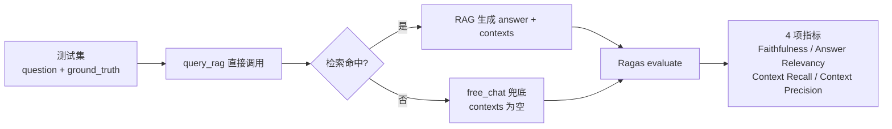
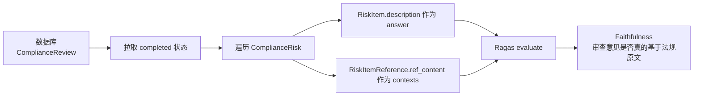

# Ragas 评估指南

本文档描述如何使用项目内置的 Ragas 评估脚本，对 **RAG 问答链路** 和 **合规审查引用质量** 进行自动化量化评估。

---

## 一、Ragas 简介

Ragas（RAG Evaluation Suite）是目前 RAG 领域最主流的开源评估框架，提供 **无需标注数据** 或 **部分标注数据** 的评估指标，覆盖 RAG 流水线的两个阶段：

| 阶段 | 核心问题 |
|------|---------|
| **检索层** | 检索到的内容对不对？有没有漏？ |
| **生成层** | 回答是否基于检索内容？有没有 LLM 幻觉？ |

本项目内置脚本 `scripts/eval_ragas.py` 封装了 Ragas，直接复用项目已有的 LLM / Embedding / RAG 管道，开箱即用。

---

## 二、评估场景

脚本支持两个独立场景，可以单独跑或一起跑：

### 场景 1: RAG 问答链路评估



**评估对象**: `query_rag()` 的回答质量。直接 import 调用，**不需要启动 FastAPI 后端**。

**核心指标解读**:

| 指标 | 含义 | 分数低说明 |
|------|------|-----------|
| **Faithfulness** | 回答中有多少是**完全基于检索上下文**的 | LLM 在瞎编（幻觉） |
| **Answer Relevancy** | 回答真正回答了问题的部分占多少 | 答非所问 / 跑题 |
| **Context Recall** | 应该检索到的相关内容中，实际拿到了多少 | 检索漏召回 |
| **Context Precision** | 检索到的内容中，有多少是真相关的 | 检索噪声多 |

### 场景 2: 合规审查引用质量评估



**评估对象**: 已完成的合规审查中，每条风险意见（`RiskItem.description`）是否真的有法规条文支撑（`RiskItemReference.ref_content`）。**需要数据库里有 completed 状态的 review**。

---

## 三、安装依赖

Ragas 与 `langchain-community 0.4.x` 有已知兼容性冲突（`ChatVertexAI` 被 upstream 移除），必须使用特定版本 + monkey-patch 绕过。

### 手动安装

```bash
uv pip install "ragas>=0.2.0,<0.3.0" "datasets>=2.14.0,<3.0.0"
```

### 或从 pyproject.toml 安装（推荐）

```bash
uv pip install -e ".[dev]"
```

`pyproject.toml` 的 dev extra 已固定版本：

```toml
dev = [
    ...
    "ragas>=0.2.0,<0.3.0",
    "datasets>=2.14.0",
]
```

### 为什么要 monkey-patch？

`langchain-community 0.4.x` 正在被官方 sunset，已经移除了 `ChatVertexAI`。但 ragas 0.2.x/0.4.x 都还在 `import ChatVertexAI`，导致启动即崩。脚本开头自动注入空模块绕过：

```python
# scripts/eval_ragas.py — 在 from ragas import ... 之前执行
_patch_langchain_community()
```

**这是脚本自带的，用户无需手动处理。** 如果未来升级 langchain-community 后冲突消除，可以删掉这段 patch。

---

## 四、使用指南

### 前置条件

1. `.env` 中 `LLM_API_KEY` / `EMBEDDING_API_KEY` 已配置
2. **RAG 场景**: 知识库（`documents` 表 + PGVector）中有文档，否则 query 会走 `free_chat`，Faithfulness 预期为 0（恰好能暴露"知识库缺文档"的问题）
3. **合规场景**: 数据库中存在 `status='completed'` 的合规审查记录

### 基本命令

```bash
# 场景 1: RAG 问答链路（使用内置测试集）
python scripts/eval_ragas.py rag

# 场景 2: 合规审查引用质量
python scripts/eval_ragas.py compliance

# 两个场景一起跑
python scripts/eval_ragas.py all
```

### 完整参数

```bash
python scripts/eval_ragas.py <scene> [options]
```

| 参数 | 类型 | 默认值 | 说明 |
|------|------|--------|------|
| `<scene>` | `rag \| compliance \| all` | — | 评估场景，必填 |
| `--dataset` | 文件路径 | 内置示例集 | 自定义 RAG 测试集 JSON（仅 rag 场景） |
| `--metrics` | 逗号分隔字符串 | 全部 4 项 | 指定跑哪些指标 |
| `--top-k` | 整数 | `5` | RAG 检索返回的 chunks 数量 |
| `--review-id` | UUID 字符串 | 第一个 completed | 合规场景指定具体 review |
| `--save` | 文件路径 | 不保存 | 保存结果为 CSV（自动按场景加后缀） |

### 常用组合示例

```bash
# 只用 Faithfulness + Answer Relevancy（最快，LLM 调用少）
python scripts/eval_ragas.py rag --metrics faithfulness,answer_relevancy

# 用自定义测试集 + 保存结果
python scripts/eval_ragas.py rag --dataset ./my_queries.json --save ./run_001.csv
# → 输出: ./run_001_rag.csv

# 合规场景指定某个具体 review
python scripts/eval_ragas.py compliance --review-id 50e12502-938d-4f43-96c4-a3627296c8a7

# 调优 RAG 参数 — top_k 从 5 改成 8 看 Recall 提升
python scripts/eval_ragas.py rag --top-k 8 --metrics context_recall
```

### 输出示例

```
🔧 初始化 LangChain LLM / Embedding ...
   LLM:       deepseek
   Embedding: bge-m3
   RAG mode:  hybrid

🔎 构建 RAG 评估数据集 (top_k=5, 5 条 query)
  🔍 query: 试用期最长不能超过多长时间？...
  🔍 query: 竞业限制的期限最长是多久？...

============================================================
🎯 [RAG] 评估开始
   样本数: 5
   指标:   [faithfulness, answer_relevancy, context_recall, context_precision]
============================================================

📋 [RAG] 汇总:
faithfulness         0.8500
answer_relevancy     0.8100
context_recall       0.7200
context_precision    0.6800
dtype: float64

📄 [RAG] 逐条详情:
                      question  faithfulness  answer_relevancy  context_recall
          试用期最长不能超过多长时间？         0.92             0.85            0.78
                 竞业限制的期限最长是多久？         0.88             0.90            0.70
               用人单位可以在劳动合同中约定违约金吗？         0.95             0.82            0.80
          违法解除劳动合同的赔偿金怎么计算？         0.78             0.75            0.65
     劳动合同到期公司不续签需要支付经济补偿吗？         0.82             0.78            0.68
```

---

## 五、测试集

### 内置测试集

脚本内置了 **5 条劳动合同方向**的 query + ground_truth（见 `scripts/eval_ragas.py:77-110`）。

**为什么是劳动合同？** 因为项目默认 Playbook + 法规种子数据的业务域是劳动法，预期你上传到 RAG 知识库的第一批文档也会是劳动合同法、民法典等法规。

**如果你的 RAG 知识库还没劳动合同文档**，这组 query 会走 `free_chat`（检索为空 → LLM 直接回答），此时 Faithfulness ≈ 0——这恰好能暴露"知识库缺文档"的问题。

### 自建测试集（推荐用于正式评估）

准备一个 JSON 文件，格式：

```json
[
  {
    "question": "试用期最长不能超过多长时间？",
    "ground_truth": "劳动合同期限三个月以上不满一年的，试用期不得超过一个月..."
  },
  {
    "question": "竞业限制的期限最长是多久？",
    "ground_truth": "竞业限制的期限不得超过二年。"
  }
]
```

| 字段 | 必填 | 说明 |
|------|------|------|
| `question` | ✅ | 用户会提的真实问题 |
| `ground_truth` | 推荐 | 理想参考答案，用于计算 Answer Relevancy / Context Recall |

使用：

```bash
python scripts/eval_ragas.py rag --dataset ./my_queries.json
```

### 测试集设计建议

| 原则 | 理由 |
|------|------|
| **20-50 条 query 足够** | Ragas 是 LLM-as-judge，跑每条要额外 2-3 次 LLM 调用，量太大成本高 |
| **覆盖正常 + 边界 case** | 例如：精确匹配 query、模糊 query、超范围 query、多跳推理 query |
| **固定测试集用于回归** | 每次改了 RAG 参数后跑同一批 query，才能比较前后差异 |
| **ground_truth 写参考答案** | 不用追求完美，能用自然语言回答"理想的答案应该长什么样"就行 |

---

## 六、指标解读速查表

### RAG 场景

| 分数区间 | Faithfulness | Answer Relevancy | Context Recall | Context Precision |
|----------|-------------|-----------------|---------------|-------------------|
| **0.9-1.0** | 优秀，几乎无幻觉 | 优秀，直击要点 | 优秀，该检索的都拿到了 | 优秀，几乎无噪声 |
| **0.7-0.9** | 良好，偶尔有轻度幻觉 | 良好，大部分相关 | 良好，漏召回率 <30% | 良好，噪声 <30% |
| **0.5-0.7** | 警告，频繁幻觉 | 警告，部分答非所问 | 警告，漏召回严重 | 警告，噪声较多 |
| **<0.5** | 严重，LLM 基本在瞎编 | 严重，几乎跑题 | 严重，检索基本没命中 | 严重，检索基本全是噪声 |

### 合规场景

合规场景只跑 **Faithfulness**（因为没有 ground_truth）。

| 分数区间 | 含义 |
|----------|------|
| **>0.8** | 审查意见忠实基于法规原文，引用可靠 |
| **0.6-0.8** | 基本可靠，但部分风险描述有 LLM 推演成分 |
| **<0.6** | 审查意见严重脱离法规原文，引用校验失效 |

---

## 七、典型使用场景

### 1. RAG 参数调优

```bash
# 对比 chunk_size=500 vs chunk_size=800 的 Context Recall
# （先改 app/config.py 里的 chunk_size，重启后端）
python scripts/eval_ragas.py rag --metrics context_recall --save ./cs500.csv
# 改 chunk_size → 重跑
python scripts/eval_ragas.py rag --metrics context_recall --save ./cs800.csv
# 对比两个 CSV 的 context_recall 均值
```

### 2. RRF 权重回归

```bash
# 改了 hybrid_search 里的 alpha 权重后，跑一遍确认没退化
python scripts/eval_ragas.py rag --metrics faithfulness,context_recall --save ./before.csv
# 改代码 → 重跑 → save ./after.csv → 对比
```

### 3. 合规审查引用校验验证

```bash
# 改了 citation_verifier.py 的阈值后，评估 RiskItem 引用质量
python scripts/eval_ragas.py compliance --metrics faithfulness
```

### 4. 批量对比（跑多次自动汇总）

```bash
# Shell 循环跑多组参数，手动对比
for topk in 3 5 8 10; do
    python scripts/eval_ragas.py rag --top-k $topk --save ./result_k${topk}.csv
done
```

---

## 八、常见问题

### Q: 运行时报 `ModuleNotFoundError: No module named 'datasets'`

**A**: 没装依赖。执行：
```bash
uv pip install "ragas>=0.2.0,<0.3.0" "datasets>=2.14.0"
```

### Q: 运行时报 `ImportError: cannot import name 'ChatVertexAI' from 'langchain_community.chat_models'`

**A**: 这是 `langchain-community 0.4.x` 与 ragas 的已知冲突。脚本开头的 `_patch_langchain_community()` 应该已经绕过了。如果仍然报错，说明脚本版本不是最新的，重新 pull 代码。

### Q: Faithfulness 全部是 0

**A**: 两条可能原因：
1. **RAG 知识库为空**：query 走了 `free_chat`，contexts 为空 → Faithfulness 必然为 0。解决：先通过 Streamlit 或 API 上传文档。
2. **query 完全超纲**：测试集里的问题在你的知识库领域之外。解决：换 `--dataset` 匹配你已有文档的业务域。

### Q: 合规场景报 "❌ 没有找到已完成的 compliance review"

**A**: 数据库里没有 `status='completed'` 的审查记录。先跑一遍合规审查，等它跑完变成 completed，再执行评估。或者用 `--review-id` 指定一个已有的 completed review。

### Q: 跑一次评估要多久？

**A**: 取决于 LLM 调用次数。Ragas 的每个指标都要额外调 1-3 次 LLM（critic model）。大致估算：

| 场景 | 指标数 | 5 条 query | 20 条 query |
|------|--------|-----------|------------|
| RAG | 4 | ~2-3 min | ~8-12 min |
| RAG | 1 (Faithfulness) | ~1 min | ~3-5 min |
| 合规 | 1 | 同 RAG | 同 RAG |

### Q: 能不能用 async / 并发跑评估？

**A**: ragas 0.2.x 的 `evaluate()` 本身是同步的，内部用 `ThreadPoolExecutor` 并发处理样本。脚本层面不需要额外并发。

---

## 九、文件位置

| 文件 | 路径 | 说明 |
|------|------|------|
| 评估脚本 | `scripts/eval_ragas.py` | 主脚本，约 360 行 |
| 依赖声明 | `pyproject.toml → [project.optional-dependencies] dev` | ragas + datasets 版本锁定 |
| 本指南 | `docs/ragas_evaluation.md` | 本文档 |