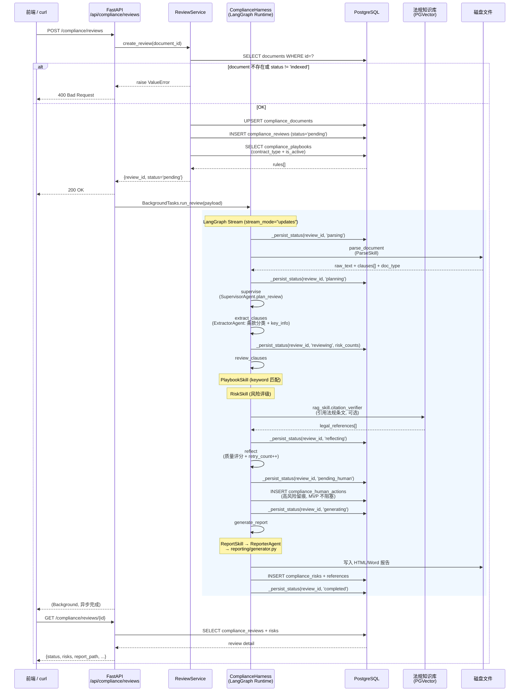
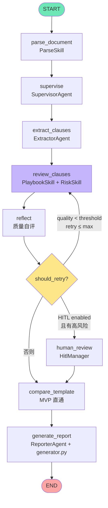
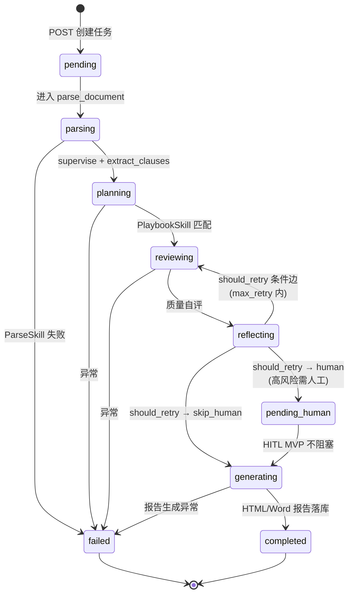
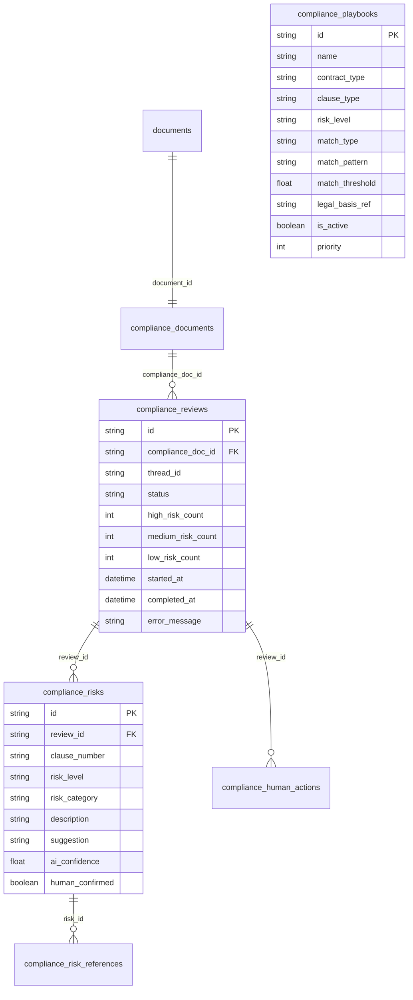

# 合规审查链路图

## API → Service → Harness 调用链

## LangGraph 工作流图

## 状态流转

## 数据库表关系（compliance_* 前缀）

## 关键组件一览

| 组件 | 文件 | 职责 |
|------|------|------|
| ReviewService | `services/review_service.py` | 业务编排：创建任务、加载 Playbook、启动 Harness |
| ComplianceHarness | `harness/runtime.py` | LangGraph 运行时：节点路由、状态落库、条件边 |
| ReviewGraph | `workflows/review_graph.py` | 图构建：节点连接 + 条件边 |
| ReviewState | `workflows/state.py` | 流水线 TypedDict + 阶段常量 |
| PlaybookSkill | `skills/playbook_skill.py` | keyword / hybrid 规则匹配 |
| RiskSkill | `skills/risk_skill.py` | 风险 5 类 × 3 级识别 |
| RagSkill | `skills/rag_skill.py` | 法规条文检索 + 引用校验 |
| ReporterAgent | `agents/reporter.py` | 报告数据组装 |
| HTML Generator | `reporting/generator.py` | 自包含 HTML 报告渲染 |
| API Router | `api/reviews.py` | CRUD + BackgroundTasks + HITL |
| Playbook 种子 | `scripts/seed_playbooks.py` | 从 `default_rules/*.json` 灌规则 |