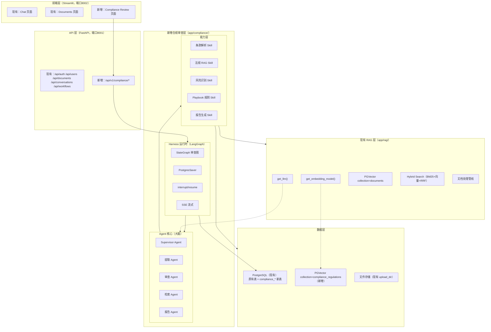

# 文档合规审查模块技术设计方案

## 0. 文档合规审查功能介绍
**面向企业法务/合规/风控团队的「智能文档审查副驾驶」**：上传合同、政策文件、内部制度、监管要求，Agent 自动识别风险点、检索相关法规依据、生成审查报告、标注修改建议，并在关键决策点等待人工确认。


---

## 1. 现有项目评估

### 1.1 项目现状

| 维度 | 现状 |
|---|---|
| 后端框架 | FastAPI 0.115+，端口 8001 |
| 前端 | Streamlit 1.40+，端口 8002 |
| ORM/迁移 | SQLAlchemy 2.0 + Alembic |
| 数据库 | 开发 SQLite，生产 PostgreSQL（psycopg2-binary，可选 asyncpg） |
| 向量库 | langchain-postgres PGVector，collection=`documents`，1024 维（bge-m3），HNSW cosine 索引 |
| RAG 检索 | Hybrid Search：PGVector 稠密 + pg_tsvector/BM25 稀疏 + RRF 融合 + 可选 bge-reranker |
| LLM | OpenAI 兼容协议（可接 DeepSeek）/ Ollama / test mock，`app/rag/llms.py:get_llm()` |
| Embedding | OpenAI 兼容（bge-m3）/ Ollama / test mock，`app/rag/embeddings.py:get_embedding_model()` |
| 文档处理 | 支持 PDF/TXT/MD/DOCX/CSV/HTML/XLSX/PPTX/TOML，`app/rag/pipeline.py` |
| 用户认证 | JWT + bcrypt + RBAC（admin/editor/viewer），`app/dependencies.py` |
| 异步任务 | Celery 可选（默认 BackgroundTasks），Redis 可选 |
| 中间件 | CORS、slowapi 限流、Tracing（request_id） |
| Workflow | 简单 BaseWorkflow + WorkflowRegistry（同步执行，非 LangGraph），已有 `doc_review` 占位示例 |
| LangGraph | 已在 `pyproject.toml` optional-dependencies 中，`uv sync --extra langgraph` 即可安装 |
| 代码风格 | 中文注释为主，类型注解，ruff line-length=100，SQLAlchemy 用 String(36) 存 UUID |

### 1.2 可直接复用的组件

| 现有组件 | 复用到合规审查模块 | 复用方式 |
|---|---|---|
| `app/config.py:Settings` | 模块配置 | 新增 `compliance_` 前缀配置字段 |
| `app/database.py:Base/SessionLocal/get_db` | 数据模型 + 会话 | 直接 import，新表继承 Base |
| `app/dependencies.py:get_current_user/require_roles` | API 鉴权 | 直接 import 到新路由 |
| `app/rag/llms.py:get_llm()` | Agent 推理 | 直接调用，审查用低 temperature |
| `app/rag/embeddings.py:get_embedding_model()` | 法规向量化 | 直接调用 |
| `app/rag/vector_store.py` PGVector 封装模式 | 法规向量库 | 参照其写法新建 `compliance_vector_store.py`，用新 collection |
| `app/rag/pipeline.py:load_document()` | 待审文档解析 | 直接调用加载 PDF/DOCX |
| `app/rag/retrievers.py` Hybrid Search 模式 | 法规检索 | 参照实现法规 hybrid 检索 |
| `app/rag/splitters.py:get_default_splitter()` | 法规文档分块 | 直接调用 |
| `app/models/` SQLAlchemy 风格 | 合规审查数据模型 | 同风格新建 |
| `app/schemas/` Pydantic 风格 | 请求/响应模型 | 同风格新建 |
| `app/services/` 业务分层 | 审查业务逻辑 | 同风格新建 |
| `app/api/router.py` 路由注册 | 合规审查 API | 新增 router 并 include |
| `app/logging_config.py:get_logger` | 日志 | 直接调用 |
| Streamlit `app/streamlit_app/` | 审查前端页面 | 新增 view，复用 api_client.py |

### 1.3 需要新增的组件

| 组件 | 说明 |
|---|---|
| `app/compliance/` 包 | 合规审查模块全部代码 |
| `langgraph` + `langgraph-checkpoint-postgres` | Agent 编排 + 状态持久化 |
| `docling`（可选，默认用现有 pypdf+python-docx） | 增强文档解析 |
| `weasyprint` | PDF 报告导出 |
| 新 PGVector collection `compliance_regulations` | 法规知识库向量库 |
| 新数据库表（`compliance_` 前缀，共 10 张） | 审查任务、条款、风险、法规、Playbook 等 |
| Alembic 迁移脚本 | 建表 |
| Streamlit 审查页面 | 前端交互 |

### 1.4 扩展原则

1. **不破坏原有功能**：新代码全部在 `app/compliance/` 包下，原有 `app/rag/`、`app/workflows/` 零修改
2. **配置可开关**：新增 `COMPLIANCE_ENABLED` 配置，关闭时不加载新路由、不影响原有功能
3. **向量库隔离**：法规用独立 collection `compliance_regulations`，不与原有 `documents` 混合
4. **数据库表隔离**：新表全部 `compliance_` 前缀
5. **API 路由隔离**：新接口全部 `/api/v1/compliance/` 前缀
6. **复用优先**：LLM、Embedding、文档加载、分块、PGVector 封装全部复用现有代码

---

## 2. 功能设计

### 2.1 核心功能（P0 - MVP，第 1~6 周）

#### F01 文档上传与解析（复用现有管线）

- 复用现有 `POST /api/documents/upload` 上传文档
- 新增合规审查专用解析：条款级拆分（按「第X条」正则 + LLM 校正）
- 自动识别合同类型：劳动合同(labor_contract)、保密协议(nda)、采购合同(procurement)、服务协议(service_agreement)、其他
- 关键信息提取：合同主体、金额、期限、付款条件、违约责任、知识产权、保密期限、争议解决
- 每个条款记录页码，便于报告引用定位

#### F02 风险条款识别与分级

- 逐条审查，识别 5 类风险：
  - `legality`（合法性）：违反法律法规强制性规定
  - `equality`（对等性）：双方权利义务不对等
  - `clarity`（明确性）：表述模糊、有歧义、缺乏可执行性
  - `completeness`（完整性）：缺失必要条款
  - `reasonableness`（合理性）：约定异常（违约金过高、期限过长、责任过重）
- 风险三级：`high`（必须修改/红线）、`medium`（建议修改/可谈判）、`low`（提示注意）
- 每个风险项输出：关联条款、风险类别、风险描述、修改建议、修改理由

#### F03 法规依据引用与溯源

- 每个风险点自动检索相关法规、司法解释
- 引用格式：法规名称 + 条款号 + 原文摘录
- **引用强制校验**：LLM 输出的引用必须与法规库原文逐字匹配，不匹配则丢弃并标记「需人工核实」
- 法规有效性检查：确保引用的法规当前有效

#### F04 审查报告生成与导出

- 报告结构：封面 → 执行摘要 → 合同基本信息 → 风险总览 → 逐条风险详情 → 法规附录
- 支持导出：Word（.docx，用 python-docx）、PDF（用 weasyprint）
- 风险项按等级排序，高风险红色、中风险黄色、低风险蓝色

#### F05 LangGraph 审查工作流（Harness）

- 完整审查流水线：解析 → 提取 → 规划 → 审查循环 → 自反思 → 报告生成
- 状态持久化：`PostgresSaver`（复用现有 PostgreSQL），审查任务可断点恢复
- 流式输出：SSE 实时推送审查进度（复用现有 conversations 的 SSE 模式）
- 自修正循环：质量不达标时自动重新审查（最多 2 次）

#### F06 法规知识库管理

- 法规文档上传 → 自动拆分条款 → 向量化 → 存入 `compliance_regulations` collection
- 法规元数据：名称、类型、发布日期、生效日期、失效日期、状态
- 支持按法规名称、条款号检索
- MVP 阶段手动录入 4 部核心法规（劳动合同方向）

### 2.2 进阶功能（P1，第 7~14 周）

#### F07 人机协同（HITL）

- 高风险项自动暂停（LangGraph `interrupt`），等待法务人工确认
- 人工操作：确认风险、修改风险等级、编辑修改建议、标记误报、添加备注
- 审查工作台：左右分栏（左侧文档原文高亮，右侧审查意见）
- 批量操作：批量确认低风险项
- 全留痕：所有人工操作记录时间、操作人、修改前后内容（`compliance_human_actions` 表）

#### F08 企业 Playbook 规则库

- 规则可视化配置：红线条款、标准措辞、可谈判项、风险阈值
- 规则三层匹配：关键词/正则（确定性）→ 语义相似度（PGVector）→ LLM 最终判定
- 规则版本化：规则变更历史可追溯
- 规则导入导出：JSON 格式

#### F09 企业模板比对

- 上传企业标准合同模板
- 自动比对待审合同与模板的差异
- 偏离项高亮：新增条款、删除条款、修改条款
- 偏离项风险分析

#### F10 版本差异审查

- 上传两版合同（v1/v2）
- 自动 diff，只审查变更部分
- 标注新增/修改/删除的条款及风险影响

#### F11 判例知识库

- 典型判例入库：案情摘要 + 争议焦点 + 裁判规则 + 法条引用
- 风险项可附参考判例
- 判例按合同类型/风险类型分类

#### F12 可观测性

- 复用现有 TracingMiddleware（request_id）
- 审查步骤全链路日志
- 审查质量统计：高风险召回率、误报率、人工采纳率

### 2.3 产品化功能（P2，第 15 周起）

#### F13 多租户与权限
#### F14 知识库管理后台
#### F15 批量审查
#### F16 合同起草辅助
#### F17 第三方系统集成（飞书/电子签/OA）
#### F18 API 开放平台
#### F19 私有化部署（Docker Compose）
#### F20 审查数据分析看板

---

## 3. 技术架构

### 3.1 整体架构图（与现有系统融合）



### 3.2 模块依赖关系

```
app/compliance/
├── api/            → 依赖 app.dependencies（鉴权）、app.compliance.services
├── services/       → 依赖 app.compliance.models、app.compliance.workflows、app.database
├── workflows/      → 依赖 app.compliance.harness、app.compliance.agents、app.compliance.skills
├── harness/        → 依赖 langgraph、app.database、app.rag.llms
├── agents/         → 依赖 app.rag.llms、app.compliance.skills
├── skills/         → 依赖 app.rag.llms、app.rag.embeddings、app.compliance.knowledge、app.compliance.playbook
├── knowledge/      → 依赖 app.rag.vector_store 模式、app.database
├── playbook/       → 依赖 app.database
├── parsing/        → 依赖 app.rag.pipeline（load_document）
├── reporting/      → 依赖 python-docx、weasyprint
├── models/         → 依赖 app.database.Base
└── schemas/        → 依赖 pydantic
```

---

## 4. 技术选型

### 4.1 新增依赖

在 `pyproject.toml` 中新增（langgraph 已存在，补充其他）：

```toml
[project.optional-dependencies]
langgraph = [
    "langgraph>=0.2.0",
    "langgraph-checkpoint-postgres>=2.0.0",  # 新增：PostgresSaver
]
compliance = [
    "langgraph>=0.2.0",
    "langgraph-checkpoint-postgres>=2.0.0",
    "weasyprint>=60.0",       # PDF 报告导出
    # docling 可选，默认用现有 pypdf + python-docx，需要增强时再加
]
```

安装命令：
```bash
uv sync --extra compliance
```

### 4.2 选型说明

| 组件 | 选型 | 理由 |
|---|---|---|
| Agent 编排 | LangGraph | 已在 optional-deps 中；多 Agent 协作、状态持久化、HITL、流式输出 |
| 状态持久化 | PostgresSaver | 复用现有 PostgreSQL，审查任务可断点恢复 |
| 法规向量库 | PGVector（新 collection） | 复用现有 langchain-postgres 封装模式，不引入新组件 |
| 法规检索 | Hybrid Search | 参照现有 retrievers.py 的 BM25+向量+RRF 模式 |
| LLM | 复用 `get_llm()` | 审查用低 temperature（0.1），减少幻觉 |
| Embedding | 复用 `get_embedding_model()` | bge-m3，1024 维 |
| 文档解析 | 复用 `load_document()` | 现有已支持 PDF/DOCX，条款拆分新增逻辑 |
| 结构化输出 | Pydantic v2 + LLM function calling | 条款提取、风险识别必须结构化 |
| Word 导出 | python-docx（已有依赖） | 直接复用 |
| PDF 导出 | weasyprint（HTML→PDF） | 报告样式可控，比 reportlab 开发快 |
| 前端 | Streamlit（新增页面） | 复用现有前端框架和 api_client.py |
| 鉴权 | 复用 JWT + RBAC | `require_roles("editor", "admin")` 保护审查接口 |

---

## 5. 详细设计

### 5.1 配置设计（追加到 app/config.py）

在 `Settings` 类中新增以下字段（追加在现有字段之后，不修改原有字段）：

```python
# ===== 合规审查模块配置 =====
compliance_enabled: bool = True
# 审查用 LLM（默认复用全局 llm_model，可单独指定）
compliance_llm_model: str = ""  # 为空则用 settings.llm_model
compliance_llm_temperature: float = 0.1  # 审查用低温度
# 法规向量库 collection
compliance_vector_collection: str = "compliance_regulations"
# 审查参数
compliance_max_retry: int = 2  # 自反思最大重试次数
compliance_quality_threshold: float = 0.7  # 自反思质量阈值
compliance_rag_top_k: int = 5  # 法规检索 Top-K
compliance_playbook_semantic_threshold: float = 0.8  # Playbook 语义匹配阈值
compliance_citation_similarity_threshold: float = 0.95  # 引用校验相似度阈值
# 人机协同
compliance_hitl_enabled: bool = True
compliance_hitl_auto_confirm_low: bool = True  # 低风险是否自动确认
# 文件路径（复用现有 upload_dir，报告存子目录）
compliance_report_dir: str = "./data/compliance/reports"
# 法规库默认合同类型（MVP 聚焦劳动合同）
compliance_default_contract_type: str = "labor_contract"
```

同时在 `.env.example` 中追加对应注释行。

### 5.2 数据库表设计（Alembic 迁移）

新建迁移脚本 `alembic/versions/xxxx_add_compliance_tables.py`，创建以下 10 张表（全部 `compliance_` 前缀）：

```sql
-- 合规审查文档（扩展现有 documents，记录审查相关元数据）
CREATE TABLE compliance_documents (
    id VARCHAR(36) PRIMARY KEY,
    document_id VARCHAR(36) NOT NULL REFERENCES documents(id) ON DELETE CASCADE,
    doc_type VARCHAR(50),  -- labor_contract/nda/procurement/service_agreement/other
    doc_type_confidence FLOAT,
    page_count INTEGER,
    status VARCHAR(20) DEFAULT 'uploaded',
    -- uploaded/parsing/parsed/reviewing/pending_human/generating/completed/failed
    created_at TIMESTAMPTZ DEFAULT NOW(),
    updated_at TIMESTAMPTZ DEFAULT NOW()
);

-- 合同条款（审查的最小单元）
CREATE TABLE compliance_clauses (
    id VARCHAR(36) PRIMARY KEY,
    compliance_doc_id VARCHAR(36) NOT NULL REFERENCES compliance_documents(id) ON DELETE CASCADE,
    clause_number VARCHAR(50),
    clause_type VARCHAR(50),  -- parties/term/payment/delivery/penalty/ip/confidentiality/dispute/...
    title VARCHAR(500),
    content TEXT NOT NULL,
    page_number INTEGER,
    sort_order INTEGER NOT NULL,
    created_at TIMESTAMPTZ DEFAULT NOW()
);
CREATE INDEX idx_compliance_clauses_doc ON compliance_clauses(compliance_doc_id);

-- 合同关键信息
CREATE TABLE compliance_key_info (
    id VARCHAR(36) PRIMARY KEY,
    compliance_doc_id VARCHAR(36) NOT NULL REFERENCES compliance_documents(id) ON DELETE CASCADE,
    field_key VARCHAR(50) NOT NULL,  -- party_a/party_b/amount/term/payment_method/...
    field_value TEXT,
    confidence FLOAT,
    clause_id VARCHAR(36) REFERENCES compliance_clauses(id),
    created_at TIMESTAMPTZ DEFAULT NOW()
);

-- 审查任务
CREATE TABLE compliance_reviews (
    id VARCHAR(36) PRIMARY KEY,
    compliance_doc_id VARCHAR(36) NOT NULL REFERENCES compliance_documents(id) ON DELETE CASCADE,
    thread_id VARCHAR(100) NOT NULL,  -- LangGraph thread_id
    status VARCHAR(20) DEFAULT 'pending',
    -- pending/running/pending_human/completed/failed
    started_at TIMESTAMPTZ,
    completed_at TIMESTAMPTZ,
    high_risk_count INTEGER DEFAULT 0,
    medium_risk_count INTEGER DEFAULT 0,
    low_risk_count INTEGER DEFAULT 0,
    retry_count INTEGER DEFAULT 0,
    error_message TEXT,
    template_id VARCHAR(36),  -- 可选，模板比对用
    created_by VARCHAR(36) REFERENCES users(id),
    created_at TIMESTAMPTZ DEFAULT NOW()
);
CREATE INDEX idx_compliance_reviews_doc ON compliance_reviews(compliance_doc_id);
CREATE INDEX idx_compliance_reviews_thread ON compliance_reviews(thread_id);

-- 风险项
CREATE TABLE compliance_risks (
    id VARCHAR(36) PRIMARY KEY,
    review_id VARCHAR(36) NOT NULL REFERENCES compliance_reviews(id) ON DELETE CASCADE,
    clause_id VARCHAR(36) REFERENCES compliance_clauses(id),
    risk_level VARCHAR(10) NOT NULL,  -- high/medium/low
    risk_category VARCHAR(30) NOT NULL,  -- legality/equality/clarity/completeness/reasonableness
    description TEXT NOT NULL,
    suggestion TEXT,
    suggestion_reason TEXT,
    playbook_rule_id VARCHAR(36),
    ai_confidence FLOAT DEFAULT 1.0,
    human_confirmed BOOLEAN DEFAULT FALSE,
    human_decision VARCHAR(20),  -- confirmed/modified/rejected/na
    human_note TEXT,
    human_reviewed_at TIMESTAMPTZ,
    human_reviewed_by VARCHAR(36) REFERENCES users(id),
    sort_order INTEGER NOT NULL,
    created_at TIMESTAMPTZ DEFAULT NOW()
);
CREATE INDEX idx_compliance_risks_review ON compliance_risks(review_id);
CREATE INDEX idx_compliance_risks_level ON compliance_risks(risk_level);

-- 风险项的法规/判例引用
CREATE TABLE compliance_risk_references (
    id VARCHAR(36) PRIMARY KEY,
    risk_id VARCHAR(36) NOT NULL REFERENCES compliance_risks(id) ON DELETE CASCADE,
    ref_type VARCHAR(20) NOT NULL,  -- regulation/judicial_case/playbook
    ref_name VARCHAR(500) NOT NULL,
    ref_article VARCHAR(100),
    ref_content TEXT NOT NULL,
    ref_source_url VARCHAR(1000),
    verified BOOLEAN DEFAULT FALSE,  -- 是否通过原文逐字校验
    created_at TIMESTAMPTZ DEFAULT NOW()
);

-- 法规库
CREATE TABLE compliance_regulations (
    id VARCHAR(36) PRIMARY KEY,
    title VARCHAR(500) NOT NULL,
    regulation_type VARCHAR(30) NOT NULL,  -- law/admin_regulation/judicial_interpretation/local_rule
    publish_date DATE,
    effective_date DATE,
    expire_date DATE,
    status VARCHAR(20) DEFAULT 'active',  -- active/expired/amended
    source VARCHAR(100),
    version INTEGER DEFAULT 1,
    created_at TIMESTAMPTZ DEFAULT NOW()
);

-- 法规条款（向量化存储，PGVector collection=compliance_regulations）
CREATE TABLE compliance_regulation_articles (
    id VARCHAR(36) PRIMARY KEY,
    regulation_id VARCHAR(36) NOT NULL REFERENCES compliance_regulations(id) ON DELETE CASCADE,
    article_number VARCHAR(50) NOT NULL,
    chapter VARCHAR(200),
    section VARCHAR(200),
    content TEXT NOT NULL,
    -- 向量由 langchain-postgres 管理（langchain_pg_embedding 表），此表存结构化元数据
    sort_order INTEGER NOT NULL,
    created_at TIMESTAMPTZ DEFAULT NOW()
);
CREATE INDEX idx_compliance_articles_reg ON compliance_regulation_articles(regulation_id);

-- Playbook 审查规则
CREATE TABLE compliance_playbooks (
    id VARCHAR(36) PRIMARY KEY,
    name VARCHAR(200) NOT NULL,
    description TEXT,
    contract_type VARCHAR(50) NOT NULL,
    clause_type VARCHAR(50),
    risk_level VARCHAR(10) NOT NULL,
    match_type VARCHAR(20) NOT NULL,  -- keyword/semantic/hybrid
    match_pattern TEXT,
    match_threshold FLOAT DEFAULT 0.8,
    legal_basis_ref TEXT,
    standard_position TEXT,
    red_line BOOLEAN DEFAULT FALSE,
    negotiable BOOLEAN DEFAULT TRUE,
    suggested_clause TEXT,
    priority INTEGER DEFAULT 100,
    is_active BOOLEAN DEFAULT TRUE,
    version INTEGER DEFAULT 1,
    created_by VARCHAR(36) REFERENCES users(id),
    created_at TIMESTAMPTZ DEFAULT NOW(),
    updated_at TIMESTAMPTZ DEFAULT NOW()
);
CREATE INDEX idx_compliance_playbooks_type ON compliance_playbooks(contract_type);

-- 人工审核操作日志
CREATE TABLE compliance_human_actions (
    id VARCHAR(36) PRIMARY KEY,
    review_id VARCHAR(36) NOT NULL REFERENCES compliance_reviews(id) ON DELETE CASCADE,
    risk_id VARCHAR(36) REFERENCES compliance_risks(id),
    action_type VARCHAR(30) NOT NULL,
    -- confirm/modify_level/edit_suggestion/mark_false/add_note/batch_confirm
    old_value TEXT,
    new_value TEXT,
    operator_id VARCHAR(36) REFERENCES users(id),
    created_at TIMESTAMPTZ DEFAULT NOW()
);

-- 审查报告
CREATE TABLE compliance_reports (
    id VARCHAR(36) PRIMARY KEY,
    review_id VARCHAR(36) NOT NULL REFERENCES compliance_reviews(id) ON DELETE CASCADE,
    format VARCHAR(10) NOT NULL,  -- word/pdf/html
    file_path VARCHAR(1000) NOT NULL,
    file_size BIGINT,
    generated_at TIMESTAMPTZ DEFAULT NOW()
);
```

> 注意：法规条款的向量存储复用 langchain-postgres 的 `langchain_pg_embedding` 表（通过 collection_name=`compliance_regulations` 隔离），`compliance_regulation_articles` 表存结构化元数据，二者通过 article_number + regulation_id 关联。

### 5.3 Pydantic 模型（app/compliance/schemas/）

```python
# app/compliance/schemas/__init__.py
# 以下为核心模型，完整文件由 AI Coding 生成

from enum import Enum
from datetime import datetime
from typing import Optional
from pydantic import BaseModel, Field


class DocType(str, Enum):
    LABOR_CONTRACT = "labor_contract"
    NDA = "nda"
    PROCUREMENT = "procurement"
    SERVICE_AGREEMENT = "service_agreement"
    OTHER = "other"


class RiskLevel(str, Enum):
    HIGH = "high"
    MEDIUM = "medium"
    LOW = "low"


class RiskCategory(str, Enum):
    LEGALITY = "legality"
    EQUALITY = "equality"
    CLARITY = "clarity"
    COMPLETENESS = "completeness"
    REASONABLENESS = "reasonableness"


class ClauseType(str, Enum):
    PARTIES = "parties"
    TERM = "term"
    PAYMENT = "payment"
    DELIVERY = "delivery"
    PENALTY = "penalty"
    IP = "ip"
    CONFIDENTIALITY = "confidentiality"
    DISPUTE = "dispute"
    TERMINATION = "termination"
    FORCE_MAJEURE = "force_majeure"
    OTHER = "other"


# ---- 条款与关键信息 ----

class Clause(BaseModel):
    clause_number: str = Field(description="条款号，如'第3条第2款'")
    clause_type: ClauseType
    title: Optional[str] = None
    content: str
    page_number: Optional[int] = None


class KeyInfo(BaseModel):
    party_a: Optional[str] = None
    party_b: Optional[str] = None
    sign_date: Optional[str] = None
    effective_date: Optional[str] = None
    term: Optional[str] = None
    amount: Optional[str] = None
    payment_method: Optional[str] = None
    penalty_cap: Optional[str] = None
    ip_ownership: Optional[str] = None
    confidentiality_period: Optional[str] = None
    dispute_resolution: Optional[str] = None


# ---- 风险识别（LLM 结构化输出）----

class LegalReference(BaseModel):
    ref_type: str = Field(description="regulation/judicial_case")
    ref_name: str
    ref_article: Optional[str] = None
    ref_content: str


class RiskItem(BaseModel):
    clause_number: str
    risk_level: RiskLevel
    risk_category: RiskCategory
    description: str
    suggestion: Optional[str] = None
    suggestion_reason: Optional[str] = None
    legal_references: list[LegalReference] = Field(default_factory=list)
    ai_confidence: float = 1.0


class ReviewResult(BaseModel):
    doc_type: DocType
    key_info: KeyInfo
    clauses: list[Clause]
    risks: list[RiskItem]
    summary: str


# ---- API 请求/响应 ----

class ReviewCreateRequest(BaseModel):
    document_id: str
    template_id: Optional[str] = None
    contract_type_override: Optional[DocType] = None


class ReviewCreateResponse(BaseModel):
    review_id: str
    thread_id: str
    status: str


class RiskItemResponse(BaseModel):
    id: str
    clause_number: Optional[str] = None
    clause_content: Optional[str] = None
    risk_level: str
    risk_category: str
    description: str
    suggestion: Optional[str] = None
    legal_references: list[LegalReference] = Field(default_factory=list)
    human_confirmed: bool = False
    human_decision: Optional[str] = None
    model_config = {"from_attributes": True}


class ReviewDetailResponse(BaseModel):
    review_id: str
    document_id: str
    status: str
    doc_type: Optional[str] = None
    key_info: Optional[dict] = None
    high_risk_count: int = 0
    medium_risk_count: int = 0
    low_risk_count: int = 0
    risks: list[RiskItemResponse] = Field(default_factory=list)
    created_at: datetime
    completed_at: Optional[datetime] = None


class HumanReviewRequest(BaseModel):
    action: str = Field(description="confirm/modify_level/edit_suggestion/mark_false/batch_confirm")
    risk_ids: list[str]
    new_risk_level: Optional[str] = None
    new_suggestion: Optional[str] = None
    note: Optional[str] = None


class RegulationIngestRequest(BaseModel):
    title: str
    regulation_type: str
    file_path: str  # 已上传的法规文件路径
    publish_date: Optional[str] = None
    effective_date: Optional[str] = None


class PlaybookCreateRequest(BaseModel):
    name: str
    description: Optional[str] = None
    contract_type: str
    clause_type: Optional[str] = None
    risk_level: str
    match_type: str = "keyword"
    match_pattern: Optional[str] = None
    legal_basis_ref: Optional[str] = None
    standard_position: Optional[str] = None
    red_line: bool = False
    negotiable: bool = True
    suggested_clause: Optional[str] = None
    priority: int = 100
```

### 5.4 SQLAlchemy 模型（app/compliance/models/）

参照 `app/models/document.py` 的风格，每个表一个类，继承 `app.database.Base`，主键用 `String(36)` + `uuid.uuid4()`，时间用 `datetime.now(timezone.utc)`。

文件结构：
```
app/compliance/models/
├── __init__.py          # 统一导出所有模型
├── document.py          # ComplianceDocument
├── clause.py            # ComplianceClause + ComplianceKeyInfo
├── review.py            # ComplianceReview + ComplianceRisk + ComplianceRiskReference
├── regulation.py        # ComplianceRegulation + ComplianceRegulationArticle
├── playbook.py          # CompliancePlaybook
├── report.py            # ComplianceReport + ComplianceHumanAction
```

### 5.5 LangGraph 审查工作流（app/compliance/workflows/）

#### 5.5.1 State 定义

```python
# app/compliance/workflows/state.py
from typing import TypedDict, Optional, Literal


class ReviewState(TypedDict):
    # 输入
    document_id: str
    compliance_doc_id: str
    file_path: str
    file_type: str
    template_id: Optional[str]
    contract_type_override: Optional[str]
    user_id: Optional[str]

    # 文档解析
    raw_text: str
    doc_type: str
    clauses: list[dict]
    key_info: dict

    # 审查计划
    review_plan: list[str]

    # 审查结果
    risks: list[dict]
    review_summary: str

    # 模板比对
    template_diff: Optional[list[dict]]

    # 自反思
    retry_count: int
    quality_score: float

    # 人机协同
    pending_human_review: list[str]
    human_decisions: dict

    # 输出
    report_id: Optional[str]
    report_path: Optional[str]
    status: Literal["parsing", "planning", "reviewing", "reflecting",
                    "pending_human", "generating", "completed", "failed"]
    error: Optional[str]
```

#### 5.5.2 审查图构建

```python
# app/compliance/workflows/review_graph.py
from langgraph.graph import StateGraph, END
from app.compliance.workflows.state import ReviewState
from app.compliance.harness.runtime import ComplianceHarness


def build_review_graph(harness: ComplianceHarness) -> StateGraph:
    g = StateGraph(ReviewState)

    # 节点
    g.add_node("parse", harness.parse_document)
    g.add_node("supervise", harness.supervise)
    g.add_node("extract", harness.extract_clauses)
    g.add_node("review", harness.review_clauses)
    g.add_node("reflect", harness.reflect)
    g.add_node("compare", harness.compare_template)
    g.add_node("human_review", harness.human_review)
    g.add_node("generate_report", harness.generate_report)

    # 边
    g.set_entry_point("parse")
    g.add_edge("parse", "supervise")
    g.add_edge("supervise", "extract")
    g.add_edge("extract", "review")

    g.add_conditional_edges("review", harness.should_compare, {
        "compare": "compare",
        "skip": "reflect",
    })
    g.add_edge("compare", "reflect")

    g.add_conditional_edges("reflect", harness.should_retry, {
        "retry": "review",
        "human": "human_review",
        "skip_human": "generate_report",
    })
    g.add_edge("human_review", "generate_report")
    g.add_edge("generate_report", END)

    return g
```

#### 5.5.3 Harness 运行时（app/compliance/harness/runtime.py）

```python
# app/compliance/harness/runtime.py
"""ComplianceHarness — 审查工作流的运行时底座（躯体）。
封装 LangGraph 图、PostgresSaver、工具调用、人机协同、流式输出。
Agent 核心（大脑）在 agents/ 中实现，Harness 只负责执行。
"""
from functools import lru_cache
from langgraph.checkpoint.postgres import PostgresSaver
from app.config import settings
from app.database import engine
from app.compliance.workflows.review_graph import build_review_graph


class ComplianceHarness:
    def __init__(self):
        self.checkpointer = self._build_checkpointer()
        self.graph = build_review_graph(self).compile(checkpointer=self.checkpointer)

    def _build_checkpointer(self) -> PostgresSaver:
        # 复用现有 PostgreSQL 连接，PostgresSaver 需要 psycopg3
        # 注意：现有项目用 psycopg2-binary，PostgresSaver 需要 psycopg3
        # 解决方案：用 settings.vector_store_url（psycopg3 格式）或新增 COMPLIANCE_CHECKPOINTER_URL
        from langgraph.checkpoint.postgres import PostgresSaver
        conn_string = settings.vector_store_url or settings.database_url
        saver = PostgresSaver.from_conn_string(conn_string)
        saver.setup()  # 首次运行创建 checkpoint 表
        return saver

    # ---- 图节点实现（调用 skills 和 agents）----
    def parse_document(self, state: ReviewState) -> ReviewState: ...
    def supervise(self, state: ReviewState) -> ReviewState: ...
    def extract_clauses(self, state: ReviewState) -> ReviewState: ...
    def review_clauses(self, state: ReviewState) -> ReviewState: ...
    def reflect(self, state: ReviewState) -> ReviewState: ...
    def compare_template(self, state: ReviewState) -> ReviewState: ...
    def human_review(self, state: ReviewState) -> ReviewState: ...  # 含 interrupt
    def generate_report(self, state: ReviewState) -> ReviewState: ...

    # ---- 条件边 ----
    def should_compare(self, state: ReviewState) -> str: ...
    def should_retry(self, state: ReviewState) -> str: ...

    # ---- 对外 API ----
    async def start_review(self, review_id: str, document_id: str, user_id: str, ...):
        """启动审查任务，返回 thread_id"""
        config = {"configurable": {"thread_id": f"review-{review_id}"}}
        async for event in self.graph.astream(
            {"document_id": document_id, "user_id": user_id, ...},
            config,
            stream_mode="updates",
        ):
            yield event

    async def resume_review(self, review_id: str, human_decisions: dict):
        """人工审核完成后继续执行"""
        config = {"configurable": {"thread_id": f"review-{review_id}"}}
        await self.graph.ainvoke(None, config, input=human_decisions)


@lru_cache
def get_harness() -> ComplianceHarness:
    return ComplianceHarness()
```

> **重要依赖注意**：`langgraph-checkpoint-postgres` 需要 psycopg3，而现有项目用 `psycopg2-binary`。两者可共存（psycopg2 用于 SQLAlchemy，psycopg3 用于 PostgresSaver），需在 `compliance` extra 中添加 `psycopg[binary]>=3.1.0`。

### 5.6 Agent 设计（app/compliance/agents/）

| Agent | 文件 | 职责 | 调用的 Skill |
|---|---|---|---|
| Supervisor | `supervisor.py` | 文档分类、审查计划制定 | ParseSkill |
| Extractor | `extractor.py` | 条款拆分、关键信息提取、条款类型分类 | ParseSkill |
| Reviewer | `reviewer.py` | 风险识别、分级、修改建议 | RiskSkill + PlaybookSkill + RAGSkill |
| Researcher | `researcher.py` | 法规检索、引用校验 | RAGSkill |
| Reporter | `reporter.py` | 审查报告生成 | ReportSkill |

每个 Agent 复用 `app/rag/llms.py:get_llm()`，审查用 `temperature=0.1`。

Reviewer Agent 核心 Prompt（`app/compliance/agents/prompts/reviewer_prompt.py`）：
- 5 类风险维度（合法性/对等性/明确性/完整性/合理性）
- 3 级风险（high/medium/low）
- 输出结构化 RiskItem（Pydantic function calling）
- 约束：不编造法规、不确定标记 low、修改建议要具体可执行

### 5.7 法规知识库（app/compliance/knowledge/）

#### 5.7.1 向量库封装（参照 app/rag/vector_store.py）

```python
# app/compliance/knowledge/vector_store.py
"""法规向量库 — 独立 collection=compliance_regulations，复用 PGVector 封装模式。"""
from functools import lru_cache
from sqlalchemy import create_engine, text
from langchain_core.documents import Document
from langchain_postgres.vectorstores import DistanceStrategy, PGVector
from app.config import settings
from app.rag.embeddings import get_embedding_model
from app.logging_config import get_logger

logger = get_logger(__name__)
EMBEDDING_DIM = 1024  # 复用 bge-m3 维度
_hnsw_index_ensured = False


@lru_cache
def _maintenance_engine():
    return create_engine(settings.vector_store_url, ...)


@lru_cache
def get_regulation_vector_store() -> PGVector:
    return PGVector(
        embeddings=get_embedding_model(),
        collection_name=settings.compliance_vector_collection,  # "compliance_regulations"
        connection=settings.vector_store_url,
        embedding_length=EMBEDDING_DIM,
        distance_strategy=DistanceStrategy.COSINE,
        use_jsonb=True,
        create_extension=True,
    )


def add_regulations_to_store(docs: list[Document]) -> list[str]:
    vs = get_regulation_vector_store()
    ids = vs.add_documents(docs)
    _ensure_hnsw_index()
    return ids


def search_regulations(query: str, k: int = 5, regulation_type: str = None) -> list[tuple[Document, float]]:
    vs = get_regulation_vector_store()
    filter = {"regulation_type": regulation_type} if regulation_type else None
    docs_and_dist = vs.similarity_search_with_score(query, k=k, filter=filter)
    return [(doc, 1.0 - dist) for doc, dist in docs_and_dist]
```

#### 5.7.2 法规摄入流程

```
法规文件（PDF/DOCX/TXT）
    → 复用 app/rag/pipeline.load_document() 加载
    → 复用 app/rag/splitters.get_default_splitter() 分块（法规按条款拆分更优）
    → 元数据补充：regulation_id, article_number, chapter, status
    → 写入 compliance_regulation_articles 表（结构化）
    → 向量化写入 PGVector collection=compliance_regulations
```

#### 5.7.3 MVP 阶段法规清单（劳动合同方向）

| 法规 | 优先级 |
|---|---|
| 中华人民共和国劳动合同法 | P0 |
| 中华人民共和国劳动法 | P0 |
| 劳动合同法实施条例 | P0 |
| 最高人民法院关于审理劳动争议案件适用法律问题的解释（一） | P0 |

### 5.8 Playbook 规则引擎（app/compliance/playbook/）

三层匹配：
1. **关键词/正则**：确定性匹配，命中直接标记风险
2. **语义匹配**：规则描述向量化，与条款 PGVector 相似度 > 阈值
3. **LLM 判定**：对候选命中 + 未命中规则的条款，LLM 结合法规做最终判断

规则数据存 `compliance_playbooks` 表，MVP 阶段提供劳动合同默认规则包（JSON 格式，`app/compliance/playbook/default_rules/labor_contract.json`）。

### 5.9 API 设计（app/compliance/api/）

在 `app/api/router.py` 中追加：
```python
from app.compliance.api.router import router as compliance_router
api_router.include_router(compliance_router, prefix="/v1/compliance")
```

| 方法 | 路径 | 鉴权 | 说明 |
|---|---|---|---|
| POST | `/reviews` | editor+ | 创建审查任务（异步，返回 review_id + thread_id） |
| GET | `/reviews/{review_id}` | editor+ | 获取审查详情（含风险列表） |
| GET | `/reviews/{review_id}/stream` | editor+ | SSE 流式审查进度 |
| GET | `/reviews` | editor+ | 审查任务列表（分页） |
| POST | `/reviews/{review_id}/human-review` | editor+ | 提交人工审核（HITL） |
| POST | `/reviews/{review_id}/resume` | editor+ | 人工审核完成后继续 |
| GET | `/reviews/{review_id}/report/download` | editor+ | 下载报告（format=word/pdf） |
| POST | `/knowledge/regulations/ingest` | admin | 摄入法规文档 |
| GET | `/knowledge/regulations` | editor+ | 法规列表 |
| POST | `/knowledge/regulations/search` | editor+ | 法规语义搜索 |
| POST | `/playbooks` | admin | 创建 Playbook 规则 |
| GET | `/playbooks` | editor+ | 规则列表（按合同类型筛选） |
| PUT | `/playbooks/{id}` | admin | 更新规则 |
| DELETE | `/playbooks/{id}` | admin | 删除规则 |

SSE 流式事件格式（参照现有 `app/api/conversations.py` 的 SSE 实现）：
```
event: phase
data: {"phase": "reviewing", "progress": 60, "message": "正在审查第 5/12 条..."}

event: risk
data: {"risk_id": "uuid", "risk_level": "high", "clause_number": "第8条", "description": "..."}

event: phase
data: {"phase": "completed", "progress": 100, "message": "审查完成"}
```

### 5.10 前端设计（Streamlit，app/streamlit_app/）

新增文件：
```
app/streamlit_app/views/compliance_review.py
```

页面功能：
1. 文档选择（从现有文档列表选择，或上传新文档）
2. 审查参数配置（合同类型、是否模板比对）
3. 「开始审查」按钮 → 调用 POST /reviews → 轮询/SSE 展示进度
4. 审查结果展示：风险总览（高/中/低计数）+ 风险列表（可展开查看条款原文、法规引用、修改建议）
5. 人工审核操作（高风险项：确认/修改/标记误报）
6. 报告下载按钮（Word/PDF）

在 `app/streamlit_app/app.py` 中新增页面入口，复用 `api_client.py` 的 httpx 客户端模式，新增 `compliance_api_client.py` 封装审查相关 API 调用。

### 5.11 报告生成（app/compliance/reporting/）

- 模板：Jinja2 HTML 模板（`app/compliance/reporting/templates/report_base.html`）
- Word 导出：python-docx（现有依赖），按章节填充
- PDF 导出：weasyprint（HTML→PDF）
- 报告结构：封面 → 执行摘要 → 合同基本信息 → 风险总览 → 逐条风险详情 → 法规附录

---

## 6. 完整目录结构（新增部分）

```
zz-demand-system/
├── app/
│   ├── compliance/                          # 【新增】合规审查模块
│   │   ├── __init__.py
│   │   ├── config.py                        # 模块级配置（如需要，大部分在 app/config.py）
│   │   │
│   │   ├── agents/                          # Agent 核心（大脑）
│   │   │   ├── __init__.py
│   │   │   ├── base.py                      # Agent 基类
│   │   │   ├── supervisor.py
│   │   │   ├── extractor.py
│   │   │   ├── reviewer.py
│   │   │   ├── researcher.py
│   │   │   ├── reporter.py
│   │   │   └── prompts/
│   │   │       ├── __init__.py
│   │   │       ├── supervisor_prompt.py
│   │   │       ├── extractor_prompt.py
│   │   │       ├── reviewer_prompt.py
│   │   │       └── reporter_prompt.py
│   │   │
│   │   ├── harness/                         # Harness 运行时（躯体）
│   │   │   ├── __init__.py
│   │   │   ├── runtime.py                   # ComplianceHarness 主类
│   │   │   ├── checkpointer.py              # PostgresSaver 配置
│   │   │   ├── hitl.py                      # 人机协同管理器
│   │   │   └── stream.py                    # SSE 流式输出辅助
│   │   │
│   │   ├── skills/                          # 原子能力
│   │   │   ├── __init__.py
│   │   │   ├── base.py
│   │   │   ├── parse_skill.py               # 条款解析（复用 load_document）
│   │   │   ├── rag_skill.py                 # 法规 RAG 检索
│   │   │   ├── risk_skill.py                # 风险识别
│   │   │   ├── playbook_skill.py            # Playbook 规则匹配
│   │   │   └── report_skill.py              # 报告生成
│   │   │
│   │   ├── workflows/                       # LangGraph 审查图
│   │   │   ├── __init__.py
│   │   │   ├── state.py                     # ReviewState
│   │   │   ├── review_graph.py              # 图构建
│   │   │   └── nodes.py                     # 节点实现（调用 harness）
│   │   │
│   │   ├── knowledge/                       # 法规知识库
│   │   │   ├── __init__.py
│   │   │   ├── vector_store.py              # PGVector 封装（collection=compliance_regulations）
│   │   │   ├── ingestion.py                 # 法规摄入（解析+分块+向量化）
│   │   │   ├── retrieval.py                 # 法规检索服务
│   │   │   ├── citation_verifier.py         # 引用校验器
│   │   │   └── seed_data/                   # MVP 种子法规数据
│   │   │       └── labor_contract/
│   │   │           ├── 劳动合同法.json
│   │   │           ├── 劳动法.json
│   │   │           └── 劳动合同法实施条例.json
│   │   │
│   │   ├── playbook/                        # 审查规则引擎
│   │   │   ├── __init__.py
│   │   │   ├── engine.py                    # PlaybookEngine（三层匹配）
│   │   │   └── default_rules/
│   │   │       └── labor_contract.json
│   │   │
│   │   ├── parsing/                         # 文档解析（条款拆分）
│   │   │   ├── __init__.py
│   │   │   ├── parser.py                    # 统一解析入口（复用 load_document）
│   │   │   └── clause_splitter.py           # 条款拆分器（正则+LLM校正）
│   │   │
│   │   ├── reporting/                       # 审查报告
│   │   │   ├── __init__.py
│   │   │   ├── generator.py                 # 报告生成器
│   │   │   ├── templates/
│   │   │   │   └── report_base.html
│   │   │   └── exporters/
│   │   │       ├── word_exporter.py
│   │   │       └── pdf_exporter.py
│   │   │
│   │   ├── models/                          # SQLAlchemy 模型
│   │   │   ├── __init__.py
│   │   │   ├── document.py
│   │   │   ├── clause.py
│   │   │   ├── review.py
│   │   │   ├── regulation.py
│   │   │   ├── playbook.py
│   │   │   └── report.py
│   │   │
│   │   ├── schemas/                         # Pydantic 模型
│   │   │   ├── __init__.py
│   │   │   ├── review.py
│   │   │   ├── regulation.py
│   │   │   └── playbook.py
│   │   │
│   │   ├── services/                        # 业务逻辑层
│   │   │   ├── __init__.py
│   │   │   ├── review_service.py
│   │   │   ├── regulation_service.py
│   │   │   └── playbook_service.py
│   │   │
│   │   ├── api/                             # REST API
│   │   │   ├── __init__.py
│   │   │   ├── router.py                    # 路由聚合（prefix=/v1/compliance）
│   │   │   ├── reviews.py
│   │   │   ├── knowledge.py
│   │   │   └── playbooks.py
│   │   │
│   │   └── utils/
│   │       ├── __init__.py
│   │       └── text_utils.py
│   │
│   ├── config.py                            # 【修改】追加 compliance_* 配置字段
│   ├── api/router.py                        # 【修改】追加 compliance_router
│   └── streamlit_app/
│       ├── app.py                           # 【修改】新增审查页面入口
│       ├── api_client.py                    # 【修改】追加审查相关 API 方法
│       └── views/
│           └── compliance_review.py         # 【新增】审查页面
│
├── alembic/versions/
│   └── xxxx_add_compliance_tables.py        # 【新增】建表迁移
│
├── data/
│   └── compliance/                          # 【新增】运行时数据
│       ├── regulations/                     # 法规原始文件
│       └── reports/                         # 生成的审查报告
│
├── tests/
│   └── compliance/                          # 【新增】测试
│       ├── test_parsing.py
│       ├── test_playbook.py
│       ├── test_review_graph.py
│       └── test_rag_skill.py
│
├── pyproject.toml                           # 【修改】新增 compliance extra 依赖
├── .env.example                             # 【修改】追加 compliance 配置注释
└── README.md                                # 【修改】追加合规审查模块说明
```

---

## 7. 与现有系统的集成点

### 7.1 必须修改的现有文件（共 6 个，均为追加式修改）

| 文件 | 修改内容 | 风险 |
|---|---|---|
| `app/config.py` | 追加 `compliance_*` 配置字段到 Settings 类 | 低（追加字段，有默认值） |
| `app/api/router.py` | 追加 `include_router(compliance_router, prefix="/v1/compliance")` | 低 |
| `app/streamlit_app/app.py` | 新增审查页面入口 | 低 |
| `app/streamlit_app/api_client.py` | 追加审查相关 API 方法 | 低 |
| `pyproject.toml` | 新增 `compliance` optional-dependencies | 低 |
| `.env.example` | 追加 compliance 配置注释 | 低 |

### 7.2 完全新增的文件

- `app/compliance/` 整个包（约 40 个文件）
- `alembic/versions/xxxx_add_compliance_tables.py`
- `app/streamlit_app/views/compliance_review.py`
- `tests/compliance/` 测试

### 7.3 启动时初始化

在 `app/main.py` 的 `lifespan` 中追加（可选，也可延迟初始化）：
```python
if settings.compliance_enabled:
    from app.compliance.harness.runtime import get_harness
    get_harness()  # 预热 Harness，创建 PostgresSaver 表
```

---

## 8. 开发计划与里程碑

### Phase 0：技术验证（第 1~2 周）

| 任务 | 交付物 | 验收标准 |
|---|---|---|
| 安装 langgraph + PostgresSaver | `uv sync --extra compliance` 成功 | PostgresSaver.setup() 建表成功 |
| 法规知识库搭建 | 4 部劳动法规入库 + 向量化 | 语义搜索可返回准确法条 |
| 基础审查 pipeline 脚本 | 单文件脚本：合同→LLM风险识别→RAG找法规→输出JSON | 5 份测试合同，高风险召回率 ≥ 80% |
| 测试集建设 | 10 份劳动合同 + 人工标注 | 标注完成 |

### Phase 1：MVP（第 3~8 周）

| 周 | 任务 | 交付物 |
|---|---|---|
| W3 | 数据模型 + Alembic 迁移 + 配置 | 10 张表建表成功，配置可加载 |
| W4 | 文档解析模块（条款拆分 + 关键信息提取） | 解析一份合同输出结构化条款列表 |
| W5 | 法规 RAG + 引用校验 | RegulationRAGSkill + citation_verifier 单测通过 |
| W6 | Playbook 规则引擎 + 审查 Agent | 三层匹配 + Reviewer Agent 输出 RiskItem |
| W7 | LangGraph 审查工作流 + Harness | review_graph 端到端跑通，PostgresSaver 持久化 |
| W8 | 报告生成 + API + Streamlit 页面 | Word/PDF 导出，REST API 可用，前端可上传审查 |

**MVP 验收**：上传一份劳动合同 → 10 分钟内输出审查报告（含风险项+法规引用+修改建议），高风险召回率 ≥ 90%。

### Phase 2：企业级增强（第 9~16 周）

| 周 | 任务 |
|---|---|
| W9~10 | 人机协同（HITL）：interrupt/resume + 人工操作留痕 |
| W11~12 | Playbook 管理 API + 规则可视化配置 |
| W13 | 模板比对 + 版本差异审查 |
| W14 | 判例知识库 |
| W15~16 | 多合同类型扩展（NDA + 采购合同）+ 整体优化 |

### Phase 3：产品化（第 17 周起）

多租户、知识库后台、批量审查、第三方集成、API 开放平台、私有化部署、数据分析看板。

---

## 9. 评估与质量保障

| 指标 | MVP 目标 | 产品目标 |
|---|---|---|
| 高风险召回率 | ≥ 90% | ≥ 95% |
| 风险精确率 | ≥ 75% | ≥ 85% |
| 条款提取准确率 | ≥ 90% | ≥ 95% |
| 引用准确率 | ≥ 98% | 100%（零幻觉） |
| 修改建议采纳率 | ≥ 50% | ≥ 70% |
| 单份审查耗时 | ≤ 10 分钟 | ≤ 5 分钟 |

防幻觉机制：
1. 引用强制校验（与法规库原文逐字匹配）
2. 不确定时拒绝（标记「需人工核实」）
3. Playbook 规则优先
4. 自反思校验
5. 高风险项全部人工确认

---

## 10. 风险与应对

| 风险 | 影响 | 应对 |
|---|---|---|
| PostgresSaver 需 psycopg3，现有用 psycopg2 | 依赖冲突 | 两者可共存，compliance extra 中加 `psycopg[binary]`；或用 AsyncPostgresSaver |
| LLM 幻觉（编造法规） | 致命 | 引用强制校验 + 规则优先 + 不确定拒绝 + 人工兜底 |
| 条款提取不准确 | 后续审查全错 | 正则+LLM 混合拆分 + 字段级校验 |
| 长合同（50页+）超上下文 | 体验差 | 条款级并行审查 + 摘要聚合 |
| 法务不信任 AI | 产品没人用 | HITL 设计 + 过程透明可追溯 + 用数据证明准确率 |
| weasyprint 安装依赖系统库 | 部署复杂 | 提供 reportlab 备选；Docker 镜像中预装 |

---

## 11. AI Coding 执行顺序

> 供 AI Coding 工具按顺序生成，每步可独立验证。

1. **Step 1**：修改 `pyproject.toml` 新增 compliance extra → `uv sync --extra compliance` 验证
2. **Step 2**：修改 `app/config.py` 追加 compliance_* 字段 → 启动服务验证配置加载
3. **Step 3**：生成 `app/compliance/models/`（6 个文件）→ `python -c "from app.compliance.models import *"` 验证
4. **Step 4**：生成 Alembic 迁移脚本 → `alembic upgrade head` 建表成功
5. **Step 5**：生成 `app/compliance/schemas/` → Pydantic 校验通过
6. **Step 6**：生成 `app/compliance/knowledge/vector_store.py` → 法规向量库可写入可检索
7. **Step 7**：生成 `app/compliance/knowledge/ingestion.py` + 种子数据 → 4 部法规入库成功
8. **Step 8**：生成 `app/compliance/parsing/`（parser + clause_splitter）→ 单测：解析 PDF 输出条款
9. **Step 9**：生成 `app/compliance/playbook/engine.py` + 默认规则 → 单测：含试用期条款能命中规则
10. **Step 10**：生成 `app/compliance/agents/`（reviewer + prompts）→ 单测：输入条款输出 RiskItem
11. **Step 11**：生成 `app/compliance/skills/`（封装以上能力）
12. **Step 12**：生成 `app/compliance/workflows/`（state + review_graph）→ 端到端跑通一份合同
13. **Step 13**：生成 `app/compliance/harness/runtime.py`（PostgresSaver + 流式）→ 可持久化、可断点恢复
14. **Step 14**：生成 `app/compliance/reporting/`（generator + exporters）→ 生成 Word 报告
15. **Step 15**：生成 `app/compliance/services/` + `app/compliance/api/` → 修改 router.py → FastAPI 可调用
16. **Step 16**：生成 `app/streamlit_app/views/compliance_review.py` → 修改 app.py → 前端可操作
17. **Step 17**：生成 `tests/compliance/` → pytest 全绿
18. **Step 18**：更新 README.md + .env.example → 文档完整

---

## 附录 A：现有代码关键复用点速查

| 需求 | 现有代码位置 | 调用方式 |
|---|---|---|
| 获取 LLM | `app/rag/llms.py:get_llm()` | `from app.rag.llms import get_llm; llm = get_llm()` |
| 获取 Embedding | `app/rag/embeddings.py:get_embedding_model()` | `from app.rag.embeddings import get_embedding_model` |
| 加载文档 | `app/rag/pipeline.py:load_document(file_path, mime_type)` | 返回 `list[Document]` |
| 文本分块 | `app/rag/splitters.py:get_default_splitter()` | `splitter.split_documents(docs)` |
| PGVector 模式 | `app/rag/vector_store.py` | 参照写法新建法规向量库 |
| Hybrid 检索模式 | `app/rag/retrievers.py:hybrid_search()` | 参照实现法规检索 |
| 数据库会话 | `app/database.py:SessionLocal/get_db` | 直接 import |
| ORM 基类 | `app/database.py:Base` | `class ComplianceReview(Base)` |
| 当前用户 | `app/dependencies.py:get_current_user` | FastAPI 依赖注入 |
| 角色鉴权 | `app/dependencies.py:require_roles("editor", "admin")` | 路由装饰器 |
| 日志 | `app/logging_config.py:get_logger(__name__)` | 直接 import |
| SSE 流式 | `app/api/conversations.py:query_conversation_stream` | 参照其 StreamingResponse 写法 |
| 文件上传 | `app/api/documents.py` | 复用现有上传接口，审查时引用 document_id |
| 配置 | `app/config.py:settings` | `settings.compliance_enabled` 等 |

---

## 附录 B：MVP 最小依赖集

```txt
# 已有依赖（无需新增）
fastapi, sqlalchemy, alembic, pydantic, langchain, langchain-community,
langchain-openai, langchain-postgres, pypdf, python-docx, httpx,
python-multipart, jinja2, psycopg2-binary

# 需新增（compliance extra）
langgraph>=0.2.0
langgraph-checkpoint-postgres>=2.0.0
psycopg[binary]>=3.1.0          # PostgresSaver 需要
weasyprint>=60.0                # PDF 导出
```

---

> 文档结束。本方案基于 zz-demand-system 实际代码库评估后生成，所有新增模块均与现有架构对齐，复用现有 RAG/LLM/Embedding/文档处理/鉴权/配置体系，可按附录 A 的 18 步顺序由 AI Coding 逐模块生成。
